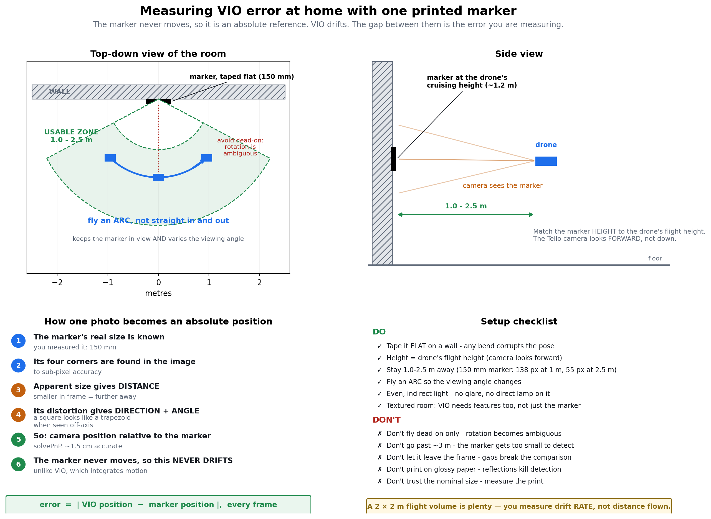

# Tello VIO — Visual-Inertial Odometry on a DJI Tello (ROS 2 Humble)

Metric, drift-bounded pose estimation on a stock DJI Tello, with no GPS and no
motion capture. A KLT/two-view visual front-end feeds an error-state Kalman
filter (real-time) and an optional fixed-lag factor-graph smoother (accuracy),
fused with the drone's own attitude, optical-flow velocity, barometer and ToF.
ORB-SLAM2 runs behind it as an optional loop-closing map backend.

> **Pipeline diagram (one page):** [`docs/Tello_VIO_Pipeline.pdf`](docs/Tello_VIO_Pipeline.pdf)
> — every stage from UDP packet to published pose, with rates and algorithms.
>
> **Full technical report (32 pages):** [`docs/Tello_VIO_Technical_Report.pdf`](docs/Tello_VIO_Technical_Report.pdf)
> — the algorithms, the derivations, the ROS 2 architecture and the measured results.

---

## Start here: what a Tello can and cannot do

This shapes every design decision in the repository, so it is stated before
anything else.

| | |
|---|---|
| **No gyroscope** | The SDK state broadcast carries *fused attitude* (whole degrees), not angular rate. Textbook tightly-coupled VIO — VINS-Mono, OpenVINS, ORB-SLAM3-VI — assumes 100–200 Hz gyro + accel. **That input does not exist on this aircraft.** |
| **~10 Hz telemetry** | And jittery. A rate differentiated from whole-degree attitude at 10 Hz carries ~10 °/s of quantisation noise. |
| **150–350 ms video latency** | H.264 over the drone's own WiFi AP, no hardware timestamps, jitter of tens of ms. |
| **Metric velocity, for free** | The Tello runs its own downward optical-flow + ToF velocity estimator (`vgx/vgy/vgz`). This is the single most valuable signal on the drone: it is **metric**, which is exactly what a monocular camera cannot be. |
| **Off-board compute** | Everything here runs on your laptop. The drone streams; it does not compute. "Efficient" means *fits in a 33 ms frame budget on one core*, not *fits on the drone*. |

**The consequence:** this is a *loosely-coupled* estimator with an explicit
metric-scale source, not a tightly-coupled one. Vision supplies rotation and
translation **direction**; magnitude comes from the flow sensor, barometer and
ToF. Pretending a monocular camera observes scale is how mono-VIO pipelines
acquire a slowly-wrong scale that poisons everything downstream.

---

## Results

From `workspace/src/tello_vio/test/test_integration.py`, a simulated 60 s
figure-of-eight with the real drone's limitations modelled (10 Hz jittery
telemetry, 1° attitude quantisation, milli-g accelerometer, integer-decimetre
velocity, drifting barometer, free-running yaw):

| Metric | Result |
|---|---|
| Absolute trajectory error (RMS), 39.8 m flown | **0.57 m** |
| Final position drift | **1.4 % of path length** |
| Metric scale accuracy (path-length ratio) | **1.034** |
| Roll/pitch RMS error | **1.8°** |
| Position NEES (ideal 3.0) | **3.2** at 40 s, **3.8** at 60 s — mildly over-confident |
| Accelerometer bias, estimated vs true | `[0.134 −0.098 0.055]` vs `[0.12 −0.08 0.05]` |

**What the camera is actually worth**, averaged over 5 seeds:

| Optical-flow quality | With vision | Without vision | Improvement |
|---|---|---|---|
| Healthy (σ = 0.08 m/s) | 0.364 m | 0.348 m | −5 % (neutral) |
| Degraded (σ = 0.30 m/s) | 0.530 m | 0.666 m | **+20 %** |
| Bad (σ = 0.80 m/s) | 0.779 m | 1.647 m | **+53 %** |
| Flow sensor dead | 0.75 m | 15.1 m | **20× better** |

Read that honestly: **when the Tello's flow sensor is working well over
textured ground, monocular VO adds little to short-horizon odometry.** Its
value is (a) redundancy — flow degrades above ~1 m altitude, over plain floors,
in low light, over moving surfaces — and (b) global consistency through loop
closure, via the ORB-SLAM2 backend. The repository does not overstate this.

`116` unit and integration tests, all passing, none requiring a drone:

```bash
cd workspace/src/tello_vio && python3 -m pytest test/ -q
```

---

## Quick start

```bash
# 1. Install (Ubuntu 22.04 + ROS 2 Humble)
./scripts/install.sh

# 2. Build
./scripts/build.sh

# 3. Connect to the Tello's WiFi AP (TELLO-XXXXXX), then:
source install/setup.bash
ros2 launch tello_vio vio.launch.py rviz:=true
```

Before the numbers mean anything, calibrate — see **Calibration** below. Running
uncalibrated produces a plausible-looking trajectory in the wrong units.

---

## Packages

```
workspace/src/
  tello/          Driver: video, telemetry, control. Publishes SI units in ROS frames.
  tello_msg/      TelloStatus / TelloID / TelloWifiConfig messages.
  tello_control/  Keyboard control GUI with a live video window.
  tello_vio/      The estimator. Pure NumPy/OpenCV core + ROS 2 nodes.
slam/src/
  orbslam2/       ORB-SLAM2 wrapper. Optional; publishes pose, TF and the map.
```

`tello_vio` is layered so everything except `nodes/` is testable and profilable
without ROS installed:

| Module | Contents |
|---|---|
| `lie.py` | SO(3)/SE(3) operations. **All conventions are declared here**, once. |
| `tello_model.py` | What the drone actually measures: units, frames, the surrogate gyro. |
| `preintegration.py` | On-manifold IMU preintegration (Forster et al., T-RO 2017). |
| `eskf.py` | 22-state error-state KF with stochastic cloning. *Real-time path.* |
| `smoother.py` | Fixed-lag factor graph with Schur-complement marginalisation. |
| `two_view.py` | Essential/homography model selection, relative pose, triangulation. |
| `frontend.py` | KLT tracking, keyframing, relative-pose measurements. |
| `calib.py` | Allan-variance IMU identification, hand-eye extrinsic, time offset. |
| `sim3.py` | Umeyama similarity alignment — `map ↔ odom`, monocular map scale. |

---

## Frames (REP-103 / REP-105)

```
map ──────────► odom ──────────► base_link ──────────► camera_optical
     may jump         continuous          static, calibrated
  (map_align)        (tello_vio)          (from camera_imu_calib)
```

* `odom → base_link` is **continuous**. Controllers differentiate it, so a jump
  there is a step input to the aircraft. Published by `tello_vio`.
* `map → odom` is **allowed to jump**. Nothing differentiates it. Published by
  `map_align`, which aligns ORB-SLAM2's scale-free trajectory to the metric VIO
  one; a loop closure lands here and the control loop never sees it.
* `base_link` is FLU (x forward, y left, z up); `camera_optical` is the REP-103
  optical frame (z out of the lens, x right, y down).

**Exactly one node owns each TF edge.** Two publishers on one edge is a broken
tree, not a redundant one.

---

## Calibration

Three quantities must be measured per airframe. Skipping any of them gives you a
confident wrong answer rather than an obviously wrong one.

**1 — Camera intrinsics.** The shipped `ost.yaml` is from somebody else's drone,
and its tangential distortion (`p1 = −0.023`) is large enough to suggest an
under-constrained fit.

```bash
./scripts/cameracalib.sh          # SIZE=8x6 SQUARE=0.025 to override
```

Fill the image corners, vary distance, and **tilt the board** — a target held
flat and centred trades focal length against distance and yields a confident
wrong `fx`.

**2 — IMU noise and biases.** Drone still, motors off, on a surface that is not
vibrating:

```bash
ros2 launch tello_vio calibrate.launch.py target:=imu duration:=120.0
```

Two minutes, not ten seconds: the Allan deviation only reveals the
bias-instability and random-walk regions once the log is many times longer than
the cluster times you care about.

**3 — Camera-IMU rotation and time offset.** Pick the drone up (motors off) and
rotate it smoothly about **all three axes** in front of a textured scene:

```bash
ros2 launch tello_vio calibrate.launch.py target:=camera_imu duration:=90.0
```

Rotating about one axis leaves the extrinsic undetermined about that axis, so
the node reports an **excitation score** alongside the residual. A small
residual with a low excitation score means the fit is confidently wrong.

Merge both YAML fragments into `workspace/src/tello_vio/config/tello_vio.yaml`.

---

## Topics

**Driver** (`tello`) publishes:

| Topic | Type | Notes |
|---|---|---|
| `/image_raw` | `sensor_msgs/Image` | ~30 Hz, `bgr8`, duplicate frames suppressed |
| `/camera_info` | `sensor_msgs/CameraInfo` | **rescaled** when `video_scale != 1.0` |
| `/imu` | `sensor_msgs/Imu` | SI, FLU. `angular_velocity_covariance[0] = -1` — there is no gyro |
| `/odom` | `nav_msgs/Odometry` | Twist only; `pose.covariance[0] = -1` — no position source |
| `/tof` | `sensor_msgs/Range` | `+inf` when out of the sensor's honest window |
| `/status`, `/id`, `/battery`, `/temperature` | | `TelloStatus` now carries a `Header` |

**Estimator** (`tello_vio`) publishes `~/odom`, `~/pose_predicted`, `~/path`,
`~/debug_image`, `/diagnostics`, and the `odom → base_link` transform.
`~/pose_predicted` is an *extrapolation* across the video latency for
controllers — separate topic, inflated covariance, never confused with the
fused estimate.

**Control:** `/takeoff`, `/land`, `/emergency`, `/flip`, `/wifi_config`, and two
velocity topics — `/control` (legacy stick axes: `linear.x` = lateral) and
`/cmd_vel` (REP-103: `linear.x` = forward, normalised to ±1).

---

## Notable fixes in this revision

An adversarial audit confirmed 30 defects in the original code. The ones that
were reachable in flight:

* **Blocking SDK calls in ROS callbacks.** `land()` retries for up to 21 s inside
  its subscriber callback. On a single-threaded executor that froze
  `/emergency` *and* the RC dead-man for the whole window, leaving a drone
  commanded forward flying forward. All blocking commands now run on a worker
  thread; `/emergency` bypasses the queue.
* **`/imu` published a fabricated zero angular velocity with zero covariance** —
  ROS semantics for "measured, and exactly known". Any consumer would believe it.
* **IMU in the drone's FRD frame with a 2 % scale error** — `z ≈ −10 m/s²` at
  rest instead of `+9.81`.
* **Attitude published without the NED→ENU conversion** — yaw and pitch ran
  backwards.
* **`camera_info` was not rescaled with `video_scale`** — at `0.5` it claimed
  twice the true focal length, which SLAM absorbs as an unrecoverable scale error.
* **`AttributeError` on most `video_scale` values** — `_resize_cache` was read
  but never initialised.
* **The ORB-SLAM2 wrapper computed a pose every frame and discarded it** — no TF,
  no odometry. It now publishes pose, TF, path and tracking state, with the
  optical→ROS rotation applied.
* **`ORB_SLAM2_ENABLE=OFF` forced the build instead of skipping it.**
* **`scripts/build.sh` did `cd ../workspace && rm -rf build install log`** — a
  relative path plus a recursive delete.

Full detail, with failure scenarios, is in the technical report.

---

## Optional: ORB-SLAM2 backend

```bash
./scripts/orbslam.sh                       # builds into libs/ORB_SLAM2
export ORB_SLAM2_ROOT_DIR="$PWD/libs/ORB_SLAM2"
./scripts/build.sh

ros2 launch tello_vio vio.launch.py slam:=true \
    vocabulary:=$PWD/libs/ORB_SLAM2/Vocabulary/ORBvoc.txt \
    slam_config:=$(ros2 pkg prefix orbslam2)/share/orbslam2/config.yaml
```

Without `ORB_SLAM2_ROOT_DIR` the package configures, warns, and skips its node,
so the rest of the workspace still builds. **The settings file must match the
resolution actually being published** — ORB-SLAM2 reads that YAML, not
`/camera_info`, so nothing will warn you if `video_scale` disagrees with it.

---

## Flying the drone

`vio.launch.py` starts the keyboard control GUI by default. **Click the "Tello"
window first** — keys go to the focused window, so typing into the terminal
does nothing. That is the single most common reason "the controls don't work".

| Key | Action |
|---|---|
| `T` | take off |
| `L` | land |
| `E` | **emergency — cuts the motors instantly.** The drone falls. |
| `F` | flip forward |
| arrow keys | move left / right / forward / back |
| `W` / `S` | up / down |
| `A` / `D` | yaw left / right |

Controls are **held only while a key is pressed**: the driver zeroes the sticks
if it hears nothing for 0.35 s, so the drone stops on its own if the GUI
freezes or you let go. That dead-man is deliberate — the Tello otherwise
latches the last command indefinitely.

Fly with `control:=false` to disable the GUI (for bag replay, or when flying
from your own node).

### Flying from your own code

The REP-103 topic is `/cmd_vel` — `+x` forward, `+y` left, `+z` up, `+yaw`
counter-clockwise, each in [-1, 1]:

```bash
ros2 topic pub -r 10 /cmd_vel geometry_msgs/msg/Twist \
  '{linear: {x: 0.3}, angular: {z: 0.0}}'
```

Publish at 10 Hz or faster or the dead-man will keep zeroing it. Take off and
land are `std_msgs/Empty`:

```bash
ros2 topic pub --once /takeoff std_msgs/msg/Empty
ros2 topic pub --once /land    std_msgs/msg/Empty
```

There is also a legacy `/control` topic using the older stick convention
(`linear.x` = lateral, `linear.y` = forward, range ±100). It is what
`tello_control` publishes; prefer `/cmd_vel` for new code.

### Before the first flight

- Clear a 2 x 2 m space, nothing overhead, no curtains or pets.
- Fly over a **textured floor** — the Tello's downward flow sensor holds
  position, and it fails over plain carpet or a shiny surface, which makes the
  drone drift regardless of what this software does.
- Keep a hand near `L` (land) and know that `E` cuts the motors.
- Battery below ~20 % makes the Tello refuse to take off.

## Measuring real accuracy against ground truth

Every accuracy figure in the technical report is **simulated**. To measure this
estimator on your own drone you need an independent, metric, drift-free
reference. There are three, and which one you can use depends on your hardware.

| Source | Accuracy | Requires | Notes |
|---|---|---|---|
| **Motion capture** (Vicon / OptiTrack) | sub-mm | a mocap lab | What published Tello research uses |
| **Mission Pads** | ~cm, 10-20 Hz | **Tello EDU / RoboMaster TT** | The Tello's own built-in reference |
| **ArUco marker** | 1-2 cm at 1-2 m | a printer | Works on any Tello |

Motion capture is the gold standard and is what the literature uses: *VizFlyt*
evaluates visual odometry on a Tello EDU against Vicon, and *AirCapRL* used a
Vicon hall specifically because the Tello's own vision-based localisation is
too inaccurate to trust. If you have access to a mocap lab, use it and publish
its pose on a topic — `evaluate_bag` takes any `PoseStamped`.

### What you need besides the drone

Two sheets of A4, printed from **[`docs/print/tello_vio_print_targets.pdf`](docs/print/tello_vio_print_targets.pdf)**:

| Page | What for |
|---|---|
| 1 | ArUco marker, 150 mm — ground truth |
| 2 | 9x7 checkerboard, 25 mm squares — camera calibration |

Plus a **ruler** and some **tape**. Nothing else: no motion capture, no extra
sensors, no Tello EDU.

Print at **100 % scale** with "fit to page" / "shrink to fit" turned OFF, then
**measure the printed target with the ruler**. Both pages carry a printed mm
scale so you can check the print in place. Printers routinely scale by a few
percent, and that error passes straight into every metric result — so pass
what you actually measure, not the nominal size.

Regenerate with `python3 docs/make_print_targets.py`.

### Which do you have? Ask the drone

```bash
python3 scripts/probe_drone.py
```

Raw UDP, no ROS and no build required. It reports the SDK version and tries
`mon`, then tells you which ground-truth option applies to your airframe.

A note on how it judges: the Tello signals refusal in several ways, and
`error` is only one of them — an SDK 1.3 drone answers an SDK 2.0 command with
`unknown command: mon`. The probe therefore accepts **only** the exact success
token `ok` and treats everything else, including silence, as refusal.

### Option A: Mission Pads (Tello EDU only, best if you have it)

The Tello EDU's downward camera recognises printed Mission Pads and reports
the drone's own position relative to the pad centre, in centimetres, at
10–20 Hz. Because the pad is fixed in the room this is an **absolute,
drift-free** reference — exactly what VIO lacks, and therefore a genuine error
measurement rather than two estimates sharing a common drift.

```bash
ros2 launch tello_vio vio.launch.py rviz:=true mission_pad:=true

ros2 bag record -o flight1 /tello_vio/odom /mission_pad_pose
ros2 run tello_vio evaluate_bag --ros-args -p bag:=flight1 \
     -p gt_topic:=/mission_pad_pose -p plot:=err.png
```

Direction `0` is downward-only, which runs at 20 Hz rather than the 10 Hz you
get by also watching forward — and the pad is on the floor anyway.

**Verify the axis signs once.** The SDK documents the pad origin and plane but
not the axis signs. Place the drone 50 cm forward of the pad centre and check
that `position.x` reads `+0.5`; if a sign is inverted, flip it in
`mission_pad_axis_signs`. This is the same class of unverified-constant problem
as `speed_to_mps`, and it is a parameter for the same reason.

**If you have a standard Tello this will not work** — pad detection is EDU/TT
hardware, SDK 2.0+. The driver detects this and says so rather than silently
publishing nothing:

```
Mission pads are NOT supported by this drone. They require a Tello EDU or
RoboMaster TT running SDK 2.0+ ...
```

A quick way to tell which you have: if the driver logs *"firmware does not
support sdk?/sn? queries"*, you are on SDK 1.3 and mission pads are unavailable
— use Option B.

### Option B: printed ArUco marker (works on any Tello)



**The idea in one line:** the marker is bolted to the room, so the position
derived from it never drifts — while VIO, which integrates motion, does. The
gap between the two *is* the error.

**The physical setup:** tape the marker flat on a wall at roughly the height
the drone will fly (~1.2 m — the Tello's camera looks *forward*, not down),
then fly in the band **1.0–2.5 m** in front of it. That range is set by pixels,
not by preference: a 150 mm marker spans 138 px at 1 m and only 55 px at 2.5 m,
and detection gives out below ~40 px.

**Fly an arc rather than straight in and out.** An arc keeps the marker in
frame while continuously changing the viewing angle, which is what resolves the
planar rotation ambiguity. A 2 × 2 m volume is plenty — you are measuring drift
*rate*, not distance covered.


Every accuracy figure in the technical report is **simulated**. To measure
this estimator on your own drone you need an independent metric reference.
Indoors, a printed ArUco marker is the practical option: ~1-2 cm at 1-2 m,
using the same camera the estimator uses.

**1. Print a marker and measure it.**

```bash
ros2 run tello_vio make_marker --ros-args -p output:=marker.png
```

Print at 100 % scale (turn off "fit to page"), tape it to a wall, then measure
the black square with a ruler. That measurement sets the scale of every number
that follows -- printers routinely scale by a few percent, and that error
passes straight into your results.

**2. Fly with ground truth running**, keeping the marker in view:

```bash
ros2 launch tello_vio vio.launch.py rviz:=true
ros2 run tello_vio ground_truth --ros-args -p marker_size_m:=0.195
ros2 bag record -o flight1 /tello_vio/odom /tello_ground_truth/pose
```

**3. Score the flight:**

```bash
ros2 run tello_vio evaluate_bag --ros-args -p bag:=flight1 -p plot:=err.png
```

You get ATE, RPE, drift as a percentage of path length, and a three-panel plot
(trajectory top-down, per-axis, error over time).

### Reading the two ATE numbers

The report prints ATE twice, and the gap between them is the diagnostic:

| | meaning |
|---|---|
| **ATE (SE3)** | scale forced to 1 -- holds the estimator to its claim of real metres |
| **ATE (Sim3)** | scale also fitted, and reported |

If Sim3 error is much lower than SE3, the trajectory **shape** is right and the
**scale** is wrong. That points at calibration -- `speed_to_mps`, camera
intrinsics -- not at the filter. The tool says so explicitly when it detects it.

### Limits of this reference

Fiducial **translation** is accurate at any viewing angle (~1.5 cm measured).
Fiducial **rotation** is not, when the marker is viewed head-on: four coplanar
corners barely constrain tilt, so two orientations fit almost equally well.
Measured on noise-free renders at 2 m: 7.3 deg error head-on versus 1.8 deg at
15-45 deg obliquity. Because camera-in-marker position depends on that
rotation, 7 deg at 2 m becomes ~25 cm of apparent position error.

The node therefore reports an `ambiguity` metric per detection and refuses to
publish a pose when it is high. Mount the marker so the drone views it at an
angle, and prefer flights where it stays large in frame.

## Troubleshooting

**`ros2 topic list` / `rqt` hangs forever (WSL2).** The `ros2` daemon fails to
start under WSL2; DDS itself is fine. Every introspection command works with the
daemon bypassed:

```bash
ros2 topic list --no-daemon
```

Launching nodes is unaffected — only the CLI introspection tools use the daemon.

**`AttributeError: _ARRAY_API not found` or `KeyError: 16` from `cv_bridge`.**
ROS 2 Humble's compiled Python extensions are built against numpy 1.x and
OpenCV 4.x. A newer numpy or OpenCV in `~/.local` shadows them and breaks
`cv_bridge` — which also breaks `camera_calibration`. Pin them back:

```bash
python3 -m pip install --user "numpy<2" "opencv-python<5"
```

`tello_vio` itself runs on either stack (the test suite passes on both); only
ROS's own extensions are version-sensitive. The driver and VIO node degrade
gracefully without `cv_bridge`, but you lose debug images and calibration.

**`CMake Error: ... CMakeCache.txt directory is different`.** A stale `build/`
tree from another path. Wipe it:

```bash
CLEAN=1 ./scripts/build.sh
```

**`OSError: [Errno 98] Address already in use` on startup.** Not a connectivity
problem. A previous driver is still holding UDP :8889.

The usual cause is stopping the launch with **Ctrl-Z instead of Ctrl-C**.
Ctrl-Z *suspends* the process — it keeps every socket it owns, indefinitely, and
sessions stack up invisibly. **Use Ctrl-C.** Check for suspended jobs with
`ps -eo pid,stat,cmd | grep tello` and look for `T` in the STAT column, or `jobs`
in the shell you launched from (`fg` then Ctrl-C, or `kill -9 %1`).

Find and stop whatever holds the port:

```bash
ss -lunp | grep -E '8889|8890|11111'
```

```bash
pkill -f 'lib/tello/tello'
```

The driver now detects this case and prints those instructions instead of a
traceback.

**The drone stops responding after ~15 s.** The Tello auto-lands if it hears no
command for 15 s. The driver sends RC at 20 Hz precisely to prevent this — check
the driver node is actually running and that `/status` is updating.

## Known limitations

* **Yaw is unbounded.** No magnetometer, so heading free-runs (~13° RMS over
  60 s in simulation). Bounding it needs loop closure or an external reference.
* **Monocular scale depends on the flow sensor.** Above ~1–2 m, or over a
  featureless floor, the metric anchor weakens — the table above quantifies it.
* **Preintegration is fed a 10 Hz surrogate rate**, not a gyro. The mathematics
  is rate-agnostic and would run unchanged on a real IMU; the *information* it
  carries here is proportionally weaker.
* **No relocalisation in the fast path.** KLT has no descriptors. Recovering
  from total tracking loss is ORB-SLAM2's job.
* **Simulation is not flight.** The results above come from a simulator built
  from the SDK's documented behaviour. Validate on a recorded bag before
  trusting any number.

## Overheating

The Tello's motor drivers overheat when it sits powered on but not flying —
exactly what calibration involves. Point a fan at it, or expect the two-minute
IMU log to end in a thermal shutdown.

## Licence

MIT. ORB-SLAM2 is GPLv3 and is *not* vendored here; `scripts/orbslam.sh` fetches
it separately.
