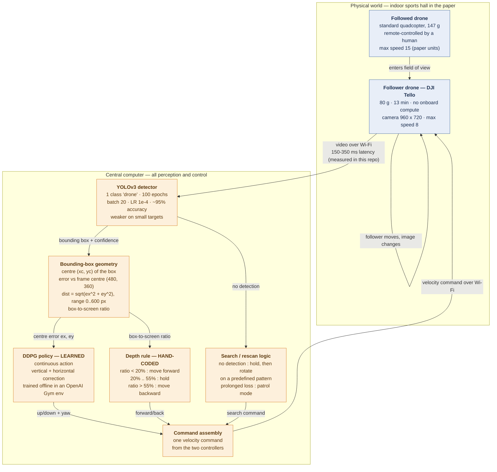
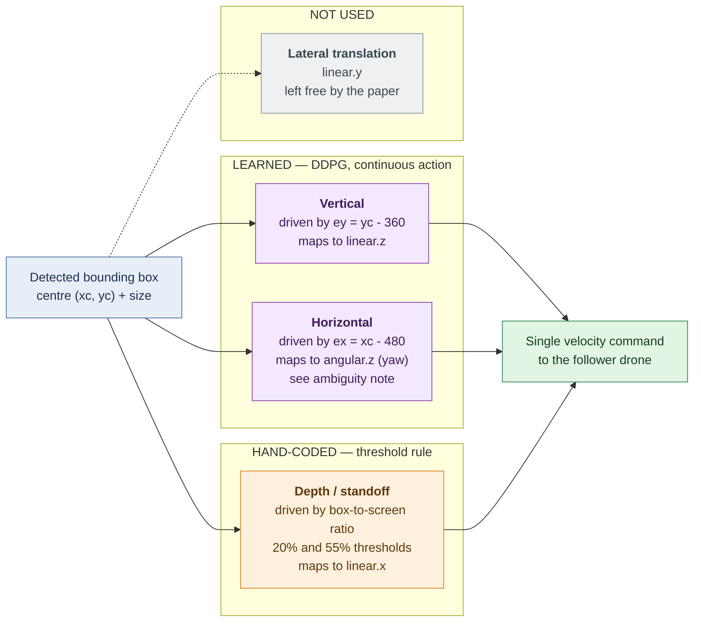
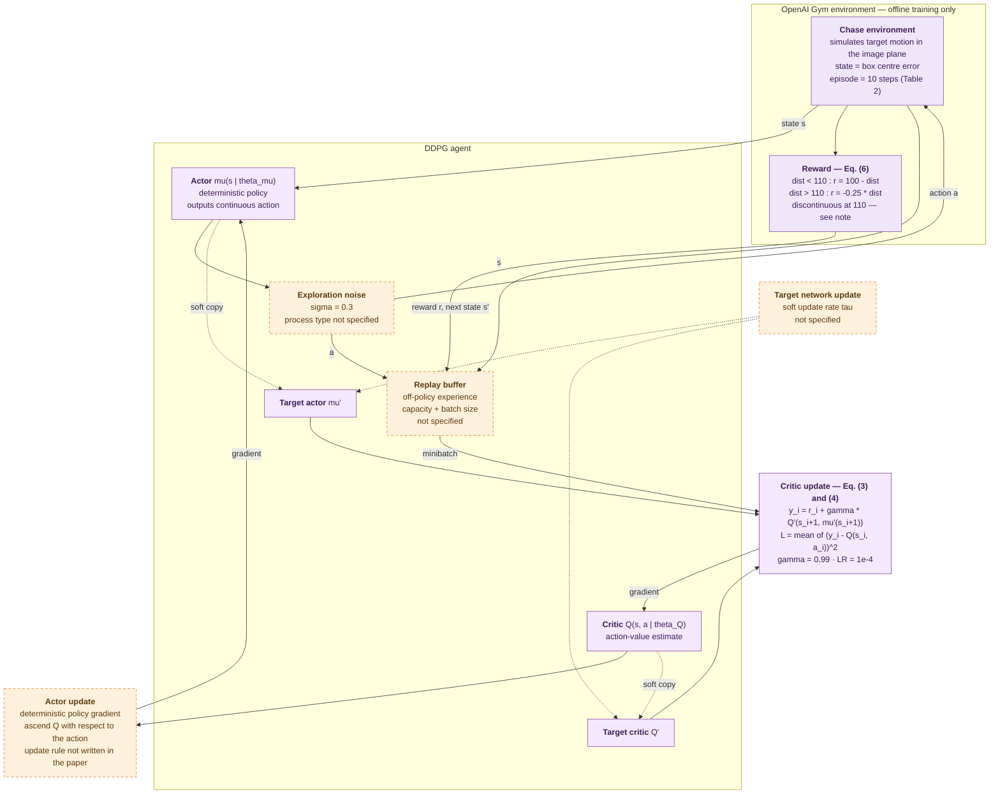
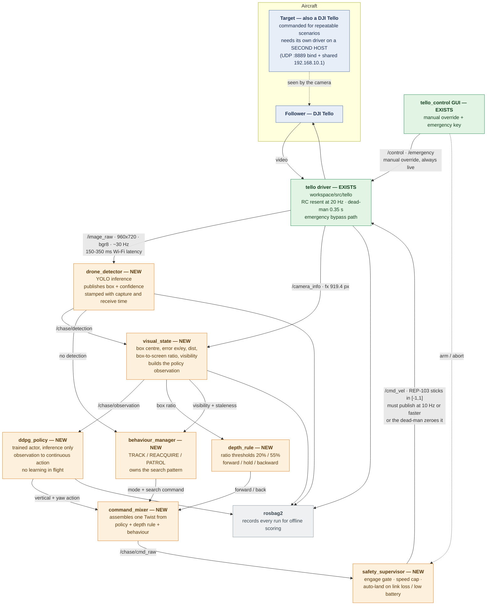
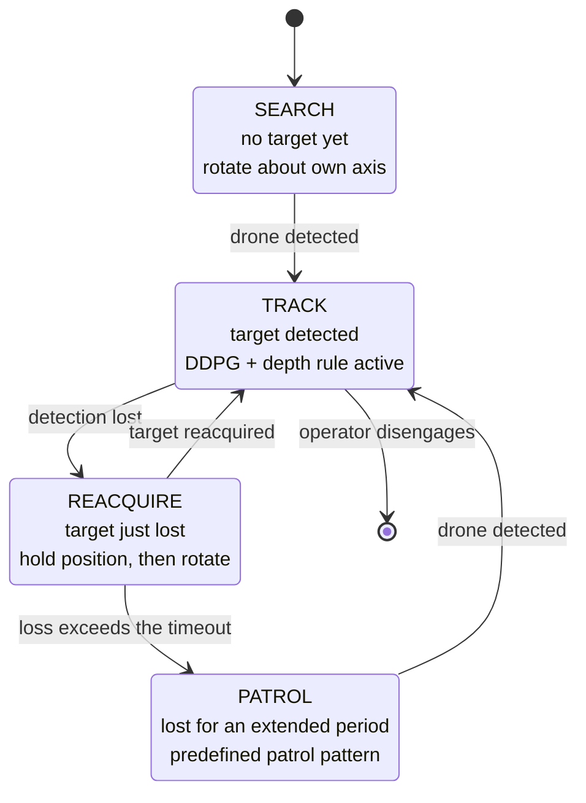
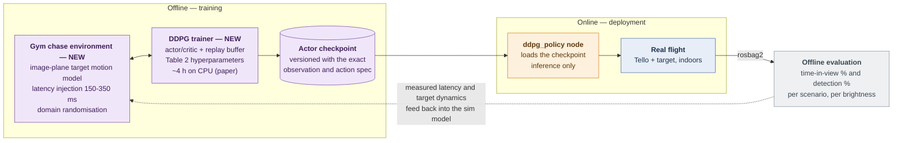

# Baseline Block Diagram — Drone Chasing Drone with DDPG

Six views, from the published concept to the ROS 2 wiring. Source for every claim marked
**[P]** is the paper (Tan & Karaköse, SoftwareX 31 (2025) 102201, section cited); **[V]** is
verified in this repository or against the manufacturer specification; **[D]** is a design
decision of this plan, with its derivation given.

1. [The published approach](#1-the-published-approach-p) — what the paper actually does
2. [The hybrid control decomposition](#2-the-hybrid-control-decomposition--the-papers-key-structural-choice) — which degrees of freedom are learned and which are hand-coded
3. [DDPG internals and the training loop](#3-ddpg-internals-and-the-training-loop-p-§222)
4. [ROS 2 node graph](#4-ros-2-node-graph--deployment) — deployment on this repository's baseline
5. [Behaviour state machine](#5-behaviour-state-machine-p-§21-item-3)
6. [Training → deployment path](#6-training--deployment-path)

Colour code: **green** = exists and verified in `workspace/src` · **orange** = to be built ·
**blue** = physical world / sensor / actuator · **purple** = offline training only · grey =
standard machinery.

---

## 1. The published approach [P]

The paper's system has three physical components [P §2.1]: the follower drone, the followed
drone, and a central computer; *"The follower drone is wirelessly connected to the central
computer"* and all perception and control run on that computer. The loop below is Fig. 1 and
Fig. 2 of the paper, expanded to the level of detail an implementation needs.

**The objective in one sentence** [P §2.1.2]: *"the difference between the red and blue dots is
minimized"* — the red dot is the detected box centre, the blue dot is the frame centre. The whole
control problem is driving that pixel error to zero while holding the box size inside a band.

**What is genuinely load-bearing here**, and easy to miss on a first read:

- The system never estimates metric distance. There is no ranging, no depth, no pose. Distance is
  regulated purely by the **apparent size** of the box against two thresholds. That is why the
  approach needs no IMU, no gyroscope, and no VIO — and why the VIO/SLAM stack on this repository
  is genuinely irrelevant to it.
- The loop is closed **through the image**, so every latency in the link appears directly as
  control delay. The paper identifies this as its main limitation twice (§4.1 and Appendix A:
  *"the latency caused by image processing and wireless communication … led to occasional
  inaccuracies in real-time tracking, especially in high-speed scenarios"*) but never quantifies
  it. This repository measures it at **150–350 ms** [V].
- **The follower is slower than the target** [P Table A.1]: 8 versus 15 in the paper's own units.
  A chaser that cannot out-run its quarry will lose it whenever the quarry commits to a direction,
  which is exactly what the worst scenario reports (42 % tracking at high target speed).

---

> **Our setup differs from the paper's here.** The diagram above describes the *published*
> system, whose target was a 147 g quadcopter flown by hand. In our project **both aircraft are
> DJI Tellos**, which (a) removes the paper's follower-slower-than-target handicap, (b) requires
> the target to be commanded rather than hand-flown, and (c) invalidates the 20 % / 55 % box-ratio
> thresholds at Tello scale. See
> [drl_ros2_reference_analysis.md §6](drl_ros2_reference_analysis.md#6-your-clarification-the-followed-drone-is-also-a-dji-tello).

## 2. The hybrid control decomposition — the paper's key structural choice

This is the single most important thing to understand before implementing, and the paper states
it in a single sentence [P §1]: *"The DDPG agent determines the up-down and yaw movements of the
drone, and the forward-backward movements are determined by the size of the box framing the
detected drone."* The controller is **not** end-to-end. Two degrees of freedom are learned, one is
a hand-written rule, and one is unused.

**Why the split exists, as far as the paper explains it.** Box size is a monotone, low-noise proxy
for distance that needs no learning, so spending policy capacity on it would be wasteful; the
centring problem, by contrast, is a continuous two-axis regulation task under delay, which is what
DDPG is for. The consequence for implementation is that **the reward function only ever sees the
centring error** [P §2.2.3] — the depth rule is outside the learning problem entirely and cannot
be improved by training.

**Ambiguity #1, and how to resolve it.** §1 says the agent controls *"up-down and yaw"*; §2.1.2
says *"other actions (up, down, right, left) are determined by the agent"*. These disagree on
whether the horizontal degree of freedom is a yaw rotation or a lateral translation. **[D]
Recommendation: implement yaw.** Three reasons: §1 is the paper's own summary of its contribution
and names yaw explicitly; yaw rotates the camera and therefore moves the target in the image
without changing the standoff distance the depth rule is simultaneously regulating, so the two
controllers stay decoupled; and the paper's own search behaviour rotates the aircraft about its
axis [P Appendix A, Scenario 3], which only makes sense if yaw is the re-centring authority.
Keep lateral translation as a documented ablation.

---

## 3. DDPG internals and the training loop [P §2.2.2]

DDPG is *"an actor-critic method … which uses two separate neural networks, one for the 'actor'
(policy) and one for the 'critic' (value function)"* and *"uses a form of off-policy learning …
learn from a replay buffer that stores many past experiences"* [P §2.2.2]. The diagram shows the
data path the paper's equations (3) and (4) describe, plus the pieces the paper leaves undefined
(dashed borders) that an implementation must nevertheless choose.

**Dashed blocks are gaps in the paper.** Network architecture, replay-buffer capacity, minibatch
size, target-update rate τ, optimiser, and the exploration-noise process are all unspecified.
Recommended values for each are in [rl_specification.md](rl_specification.md) §6 — these must be
chosen and *recorded*, or the result is not reproducible.

**Verified defect in the reward.** Evaluating Eq. (6) at the boundary gives −10 just inside the
threshold and −27.5 just outside: an ~18-unit cliff at dist = 110, and no value defined exactly at
110 because both branches use strict inequalities. A continuous repair that preserves the paper's
intent (steep gradient near the centre, gentle far away) is given in the RL specification.

**Verified scale mismatch.** γ = 0.99 has an effective horizon near 100 steps, while an episode is
10 steps [P Table 2]. The discount therefore barely influences the return, and the agent is
effectively near-myopic within an episode whatever γ says.

---

## 4. ROS 2 node graph — deployment

Green nodes exist and are verified in `workspace/src`; orange nodes are to be built. Every edge
label is a verified property, not a nominal one. Note what is **absent**: no IMU, no odometry, no
transform tree, no state estimator — the paper's method does not use them, which is why the
VIO/SLAM stack on this repository plays no part.

**Why this node split** [D, derived from P]: one node per box in diagram 1, so that each of the
paper's functional stages can be swapped, disabled, or replayed independently. Two specific
choices are worth defending. `visual_state` is separate from `drone_detector` because the
observation definition is the single most under-specified part of the paper (ambiguity #2) and
will be revised more often than the detector; keeping it separate means changing the observation
never touches the perception code. And `ddpg_policy` runs **inference only** — no learning
in flight — because the paper trains entirely in the Gym environment and deploys a fixed
checkpoint [P §2.2.1, Appendix A], and because an updating policy on a live aircraft has no
safety argument.

**The dead-man is a design constraint, not a detail** [V `node.py:1099-1114`]: the driver zeroes
the command if it goes stale by more than 0.35 s, so the policy loop must publish at 10 Hz or
faster. This is a feature worth keeping — a stalled or crashed policy node stops the aircraft
rather than latching the last command.

---

## 5. Behaviour state machine [P §2.1 item 3]

The paper describes a hand-coded recovery behaviour that is **not** learned, and it matters
because three of the five scenarios exercise it: *"If the followed drone moves out of sight, the
follower drone initiates a rescan operation"*, *"It first maintains its position and then adjusts
its field of view"*, *"The scanning operation is performed according to a predefined movement
pattern"*, and *"If no drone is detected for an extended period, the follower drone switches to a
predefined patrol mode"*. Scenario 3 tells us the pattern in practice: the follower *"switches to
search mode and scans the environment by rotating around its axis"*.

**[D] What the paper leaves to the implementer**: the loss timeout before PATROL, the rotation
rate during search, the number of consecutive missed frames that count as "lost", and the patrol
pattern itself. Recommended defaults are in the implementation plan; all four belong in one
parameter file, because they are the knobs that decide whether scenarios 3 and 4 succeed.

---

## 6. Training → deployment path

The paper trains in simulation and tests on hardware [P abstract, §2.2.1, Appendix A]: *"the
OpenAI Gym simulator is designed according to our problem, the DDPG agent is trained, the
performance of the developed system is tested in a real-world environment"*. Training took about
four hours on an Intel i5 with 8 GB of RAM, **CPU only** [P §2.2.4] — this is a small problem, and
that is a useful fact: the whole training run is reproducible on a laptop.

**The one substantive addition to the paper's pipeline** [D]: the dashed feedback edge. The paper
trains in a Gym environment whose fidelity it never describes, then reports that latency was the
dominant failure mode in the real world. Since this repository has already measured that latency
at 150–350 ms, the environment can *model* it and the policy can be trained against it — turning
the paper's headline limitation into a training condition. This is the clearest place where a
replication on this platform can exceed the original.

**The checkpoint must be versioned with its observation and action specification** [D]. A DDPG
actor is meaningless without the exact input scaling and output mapping it was trained under;
storing them together is what makes the sim-to-real transfer auditable rather than folklore.
