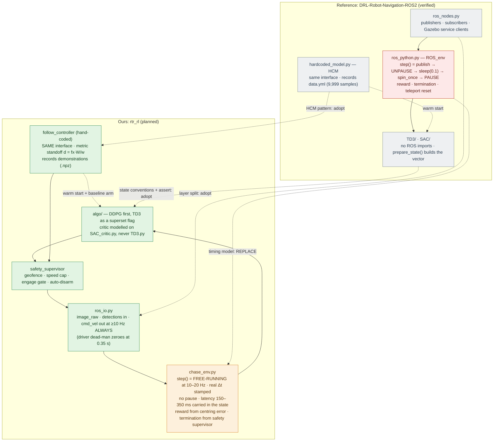

# Reference Codebase Analysis — `reiniscimurs/DRL-Robot-Navigation-ROS2`

**What this file is.** A verified read of the reference repository, and a decision — method by
method — about what transfers to the Tello drone-chasing project and what does not. Every claim
below is checked in the cloned source (`file:line`) or proved with a runnable script; nothing is
taken from the repository's README or from memory.

**Repository read.** `https://github.com/reiniscimurs/DRL-Robot-Navigation-ROS2`, cloned at
HEAD `216a23a` ("remove redundant noise"), 2026-09-08. MIT-licensed. ROS 2 Foxy + Gazebo classic,
TurtleBot3 Waffle, PyTorch. Its own README states its lineage: ROS 2 layer adapted from
`tomasvr/turtlebot3_drlnav`, TD3 from `reiniscimurs/DRL-robot-navigation`, SAC from
`denisyarats/pytorch_sac`.

**Companion documents.** [rl_specification.md](rl_specification.md) holds the state / action /
reward / algorithm decisions for our project; this file supplies the engineering patterns that
specification needs, and revises three of its assumptions (§6, §7).

> **The one-line summary.** This repository is an excellent template for *how to wire an RL agent
> into ROS 2* and a poor template for *how to run one on real hardware*: its entire environment
> loop depends on pausing Gazebo's physics, which a Tello cannot do. Take its interface design,
> its demonstration-bootstrapping, and its state-vector conventions; replace its timing model
> wholesale.

---

## 1. What the repository actually does

A TurtleBot3 learns to drive to a random goal without hitting obstacles. Laser scan in, goal in
polar form, two continuous actions out (linear + angular velocity). Two algorithms are provided,
TD3 and SAC; `train.py:37` instantiates **SAC** (TD3 is present but not selected by default).

### 1.1 The environment step — the mechanism that matters most

`ROS_env.step()` (`src/drl_navigation_ros2/ros_python.py:50-71`), verbatim structure:

```
publish cmd_vel (lin, ang)          # ros_python.py:51
unpause_physics()                   # ros_python.py:52   <-- Gazebo service call
time.sleep(0.1)                     # ros_python.py:53   <-- 10 Hz control period
rclpy.spin_once(sensor_subscriber)  # ros_python.py:54   <-- ONE callback processed
pause_physics()                     # ros_python.py:55   <-- Gazebo service call
... compute distance, cos, sin, collision, goal, reward, and return
```

Everything outside that window — the actor forward pass, the 500-iteration training loop, the
replay-buffer sampling — happens while **the world is frozen**. The agent therefore experiences a
perfectly synchronous MDP: an action is applied for exactly 0.1 s of simulated time, the
observation that follows is exactly the consequence of that action, and inference time costs
nothing. This is the single most important property of the codebase, and the single least
transferable one (§4.1).

### 1.2 State, action, reward — as implemented

| Element | Implementation | Location |
|---|---|---|
| **State**, 25-d | 20 laser bins (**min**-pooled from the raw scan) + `[distance, cos, sin]` + `[prev_lin, prev_ang]` | `TD3.py:237-260`, `SAC.py:253-279` (duplicated verbatim) |
| `inf` handling | infinite ranges replaced with `7.0` before binning | `TD3.py:241-242` |
| Goal encoding | **`cos`/`sin` of the bearing**, never the raw angle | `ros_python.py:194-212` |
| **Action**, 2-d | `tanh` output in [−1, 1]; linear remapped `(a+1)/2` → [0, 1] at the call site | `train.py:84-87` |
| **Reward** | `+100` goal · `−100` collision · else `lin − |ang|/2 − r3(min scan)/2`, with `r3(x) = 1.35 − x` for `x < 1.35` else `0` | `ros_python.py:214-222` |
| Terminal | `collision or goal` | `TD3.py:259` |
| Episode cap | 300 steps | `train.py:26` |
| Curriculum | goal spawn radius grows `+0.001` per success, 2.0 m → 8.0 m cap | `ros_python.py:186-192` |

Two encoding choices are worth lifting directly and are discussed in §3.

### 1.3 Training loop and schedule

`train.py`: 100 epochs × 70 episodes; train every 2 episodes; 500 gradient iterations per training
call; batch 40; replay buffer 5×10³ (`train.py:16-35`). Evaluation every epoch over 10 fixed
scenarios recorded once at start-up (`utils.py:39-56`), so evaluation is repeatable across epochs.

### 1.4 Demonstration bootstrapping — the most reusable idea

`hardcoded_model.py` defines `HCM`, a hand-written controller that implements **the same interface
as the learned models** — `get_action`, `prepare_state`, `train`, `save`, `load` — so it is a
drop-in substitute in the training loop. Its `prepare_state` additionally appends every sample to
`assets/data.yml` (`hardcoded_model.py:91-107`). That file, shipped in the repository, holds
**9,999 recorded samples** (verified by counting top-level YAML keys; scan length 180 per sample,
40 MB). `Pretraining.load_buffer()` replays it into the buffer, recomputing the reward with the
live reward function rather than trusting a stored one (`pretrain_utils.py:58-63`), and
`Pretraining.train()` runs 50 × 500 gradient steps before the robot ever moves
(`train.py:29-31, 53-68`).

The HCM's own policy is a reactive rule: steer toward the goal bearing, but if any binned range
is under 1.5 m, steer away from the closest obstacle instead, and slow down in proportion to the
turn (`hardcoded_model.py:26-46`).

---

## 2. Verified defects — do not copy these

I tested the two that are not visible by inspection. Both scripts are reproducible.

### 2.1 The TD3 critic never trains half of its own weights — **confirmed empirically**

`TD3.py:41-57` calls `self.layer_2_s(s1)` and discards the result, then recomputes the same
product manually as `torch.mm(s1, self.layer_2_s.weight.data.t())`. `.weight.data` is detached
from autograd, so no gradient reaches those parameters. I copied the class verbatim and ran one
backward pass:

```
Parameters receiving NO gradient:
['layer_2_s.weight', 'layer_2_s.bias', 'layer_2_a.weight', 'layer_2_a.bias',
 'layer_5_s.weight', 'layer_5_s.bias', 'layer_5_a.weight', 'layer_5_a.bias']

After one Adam step, parameters that did NOT change: (the same eight)
```

**8 of 16 critic parameters are frozen at their random initialisation** — the middle layer of both
Q-heads is a fixed random projection. (`layer_2_s.bias` and `layer_5_s.bias` are never referenced
in the forward pass at all; only the `_a` biases are added.) The network still learns, because
`layer_1`/`layer_3` do receive gradients, but it is not the architecture it appears to be.

**Consequence for us:** if we implement TD3/DDPG, write the critic with a standard `nn.Sequential`
MLP. The repository's own **SAC critic is clean** (`SAC_critic.py:7-29` uses the shared `mlp()`
builder) — prefer that one as the template.

### 2.2 Target-network updates arrive in bursts, not smoothly — **confirmed empirically**

`SAC.train()` (`SAC.py:133-140`) loops `iterations` times calling `update(step=self.step)`, and
increments `self.step` only **after** the loop (`SAC.py:146`). So `step` is constant across all
500 iterations, and `step % critic_target_update_frequency` is constant with it. Simulated trace:

```
train() call   self.step   critic upd   actor upd   target upd
1              0           500          500         500
2              1           500          500         0
3              2           500          500         500
4              3           500          500         0
```

The *total* is right (1500 target updates per 3000 gradient steps, matching `frequency=2`), but
the *distribution* is pathological: on even calls the target network is soft-updated 500 times
back-to-back, which with `tau=0.005` moves it **91.8 %** of the way to the online network in one
burst; on odd calls it is not updated at all. That is a near-hard target copy every other cycle,
not the slowly-moving target `tau=0.005` implies.

**Consequence for us:** drive target updates from a counter that increments per *gradient step*.

### 2.3 Three further issues found by inspection

- **`spin_once` processes one callback, not one of each.** `SensorSubscriber` holds *two*
  subscriptions (scan and odom, `ros_nodes.py:20-25`) but `step()` spins it once
  (`ros_python.py:54`). A single `spin_once` executes a single work item, so on any given step one
  of the two readings can be a repeat of the previous step's. Nothing in the package reads
  `header.stamp` — the only `stamp` in the whole package is on an RViz marker
  (`ros_nodes.py:184`) — and there is no `message_filters` synchroniser anywhere. The state vector
  is assembled from possibly mismatched readings, with no way to detect it.
- **`CmdVelPublisher`'s safety timer is dead code.** It creates a 0.1 s timer bound to
  `publish_cmd_vel` with default arguments — i.e. *zero velocity* (`ros_nodes.py:163-165`). That
  node is never spun (the only `spin_once` targets are `sensor_subscriber` and
  `robot_state_publisher`), so the timer never fires. Had it fired, it would have zeroed every
  command. Both facts matter to us for opposite reasons: the dead-man they accidentally disabled
  is exactly the mechanism our driver **requires** (§4.2).
- **The "previous action" in the state is on a different scale from the action in the buffer.**
  `train.py:88-96` stores the raw network action (`[−1, 1]`) in the replay buffer, while the state
  built by `prepare_state` carries the *remapped* action returned by `step()` (`lin ∈ [0, 1]`).
  Self-consistent within each role, but the same physical command appears at two different scales
  in the same transition — a trap when porting.

---

## 3. What transfers to the Tello project — ranked

### 3.1 The `HCM` demonstration-bootstrap pattern — **highest value**

This is the piece worth adopting almost unchanged, because our project already has the hand-coded
controller it needs. The paper's rule — forward if the box ratio < 20 %, back if > 55 %, plus a
proportional re-centring — is exactly an `HCM`. Adopting the pattern gives us:

1. A **behavioural floor**: the hand-coded controller is a working chase policy on day one, so
   flight testing does not wait for training to converge.
2. A **warm start**: `Pretraining` fills the buffer from recorded flight and runs gradient steps
   before the aircraft moves. With a real Tello, where every episode costs battery and risk, this
   is worth far more than it is in simulation.
3. A **baseline for the comparison** our evaluation protocol already demands: learned policy vs
   hand-coded rule, same stack, same scenarios.
4. **Reward recomputation on load** (`pretrain_utils.py:58-63`) — replay stored *transitions*, not
   stored rewards, so the reward function can be revised without re-flying. Given that our source
   paper's reward is discontinuous at dist = 110 (verified in [README.md](README.md), item 4),
   we will certainly revise it, and this makes that cheap.

Adopt the interface discipline too: our `rl_policy` node and our hand-coded `follow_controller`
should expose the identical `get_action(state) -> action` signature, so swapping them is a
parameter.

**One change:** record demonstrations to a binary format (`.npz` per episode), not appended YAML.
Their 9,999 samples cost 40 MB and are re-parsed with `yaml.full_load` on every run; our samples
carry image-derived features at 10–20 Hz over many flights.

### 3.2 The `cos`/`sin` bearing encoding — adopt, with a caveat

`ros_python.py:194-212` never feeds the network a raw angle; it feeds `cos` and `sin` of the
bearing between the robot's heading and the goal vector. This removes the ±π wrap discontinuity
that otherwise puts a step change in the middle of the state space.

For us the analogous quantity is the horizontal centring error, and it is *already* continuous
because it is measured in pixels on a bounded image plane — so the normalised `ex_n`, `ey_n` of
[rl_specification.md](rl_specification.md) §3 stay as they are. The caveat is the **search
behaviour**: when the target is lost and the aircraft yaws to re-acquire, any accumulated heading
we expose to the policy must be encoded as `(cos, sin)`, never as an angle in radians. Our yaw
also free-runs (no magnetometer), so only *relative* heading over a short horizon is admissible.

### 3.3 The state-vector layout convention — adopt

`[perception features] + [task geometry] + [previous action]`, with a hard `assert len(state) ==
self.state_dim` at the end of every `prepare_state` (`TD3.py:258`). Cheap, and it catches the
class of bug where a changed feature count silently shifts every downstream index. Our
recommended 8–9-d observation already follows this layout; keep the assert.

Their **previous-action term is the same device we specified** for latency compensation
(`rl_specification.md` §3, "last action is the standard remedy for a delayed actuator"). Seeing it
in a working ROS 2 system is corroboration — but note their justification is weaker than ours:
they have no measurable actuation delay, while we have 150–350 ms of measured video latency.

### 3.4 Sentinel-value handling for missing sensor data — adopt the principle, change the value

`TD3.py:241-242` maps `inf` laser returns to a finite `7.0` before binning, so the network never
sees a non-finite input. Our equivalent is a missing detection, and our specification already
handles it better: zero the error terms and set an explicit `visible = 0` flag, rather than
substituting a value that is indistinguishable from a real reading. Keep our version; adopt the
underlying rule — **no non-finite value ever reaches the network**, and add an assertion for it.

### 3.5 The evaluation harness — adopt

`record_eval_positions()` (`utils.py:39-56`) freezes a set of scenarios *once* at start-up and
reuses them for every epoch's evaluation, with exploration noise disabled
(`get_action(state, False)`, `train.py:145`). Fixed scenarios + deterministic actions is the
minimum for comparable numbers across epochs. Our five paper scenarios map onto this directly.

Their metrics — average return, collision rate, goal rate — go to TensorBoard alongside training
losses and Q-value statistics (`TD3.py:204-206`). Logging `avg_Q` and `max_Q` is a genuinely
useful habit: divergence in `max_Q` is the earliest visible symptom of critic over-estimation,
which is the DDPG failure mode our specification warns about.

### 3.6 The automatic curriculum — adopt the shape, not the trigger

Goal distance grows by 0.001 m per success up to 8 m (`ros_python.py:186-192`) — an implicit
curriculum with no scheduler and no episode counting. For us the analogous knob is **target
difficulty**: hover → slow straight → manoeuvring, or standoff distance. Tie the advance to a
*rolling success rate* rather than raw success count, so the curriculum can also step back down;
theirs is monotonic and cannot recover from a difficulty step it cannot solve.

### 3.7 Two-file separation of ROS from RL — adopt

`ros_nodes.py` (pure ROS: publishers, subscribers, service clients) is separate from
`ros_python.py` (the environment: reward, termination, resets), which is separate from the
algorithms (`TD3/`, `SAC/`). The algorithms import no ROS symbols at all. That separation is what
makes the models testable without a simulator, and we should mirror it exactly:
`rtr_rl/ros_io.py` · `rtr_rl/chase_env.py` · `rtr_rl/algo/`.

---

## 4. What does **not** transfer — the four blockers

### 4.1 Pausing physics — the fundamental one

Their MDP is synchronous because Gazebo can be frozen (`ros_python.py:52,55`). **A Tello cannot be
paused.** Between our policy's observation and the aircraft's response sit 150–350 ms of measured
video latency plus jitter (verified, repo `README.md`), and the world keeps moving through all of
it. Consequences, none of which their code has to face:

| Their assumption | Our reality | What we must build instead |
|---|---|---|
| Action applies to exactly the state just observed | observation is 150–350 ms old when the action lands | previous-action terms in the state (already specified); optionally an explicit delay model |
| Inference and training are free | both consume real time inside the control period | inference on the control thread; **training off-line or on a separate process**, never between steps |
| Step period is exactly 0.1 s | period jitters with Wi-Fi and decode | stamp every transition with real `Δt`; drop or flag transitions whose period is out of band |
| Reset is a service call | reset means land, reposition, take off, re-acquire | a scripted reset procedure with human confirmation, and an episode counter that tolerates minutes-long gaps |

**Do not** attempt to emulate pause/unpause on hardware by sleeping. It cannot work, and the
resulting transitions would be silently mislabelled.

### 4.2 Fire-and-forget command publishing

They publish one `Twist` per step and rely on the simulator latching it (their own dead-man timer
is dead code, §2.3). Our driver does the opposite, deliberately: `_on_rc_timer` zeroes the command
if it is older than `rc_timeout_sec = 0.35 s` (`workspace/src/tello/tello/node.py:1099-1114`),
because the Tello latches its last RC setpoint indefinitely and would otherwise keep flying. So
**our policy node must publish continuously at ≥ 10 Hz, including when it decides to do nothing**
— a zero command is a message that must be sent, not an absence of messages. A step-driven
publisher would produce visible 0.35 s stutter.

This is a case where our platform is *safer* than theirs: a hung policy stops the aircraft.

### 4.3 Teleport-based resets and privileged state

`set_position()` calls Gazebo's `/gazebo/set_entity_state` to teleport robots and obstacles
(`ros_python.py:150-162`), and the goal-relative `distance`/`cos`/`sin` come from ground-truth
odometry, not perception (`ros_python.py:194-212`). Both are privileged information a real chase
does not have: our error signal comes from a YOLO bounding box that can be **absent**, which is
a state their formulation cannot represent at all. Their `collision` flag likewise comes from a
laser minimum (`ros_python.py:181-184`); we have no equivalent sensor, so our termination
conditions must be built from mocap or geofence logic in the safety supervisor.

### 4.4 Their sensor and task

A 180-beam planar laser min-pooled into 20 bins has no analogue in a monocular chase. Do not carry
the 25-d state layout across; carry the *convention* (§3.3), not the contents.

---

## 5. Algorithm choice — what this repository adds to the decision

Our source paper specifies DDPG. This repository implements **TD3** and **SAC**, and the one it selects
by default is SAC (`train.py:37`). That is a useful data point, because TD3 and SAC are both direct
responses to DDPG's known failure mode (critic over-estimation), and the repository shows both
running in the same ROS 2 harness with the same interface.

Recommendation for our project, unchanged in substance from
[rl_specification.md](rl_specification.md) §7 but now with concrete evidence:

- Implement **DDPG first**, faithful to the paper, so the published result is reproducible.
- Structure the code so **TD3 is a strict superset** — twin critics, target-policy smoothing,
  delayed policy updates are three additions to a DDPG skeleton, exactly as `TD3.py:143-199`
  shows. Then "DDPG vs TD3" is a configuration flag, not a rewrite.
- Take the **SAC critic** as the template for both (`SAC_critic.py`), never the TD3 critic (§2.1).

One caution from their SAC: `get_action` calls `act()` with `sample=False`, which returns the
distribution **mean**, then adds external Gaussian noise `N(0, 0.2)` (`SAC.py:155-172`). So the
learned entropy — the thing SAC's temperature is tuned to control — is not what actually explores.
That is unconventional; if we use SAC, sample from the policy instead.

---

## 6. Your clarification: the followed drone is also a DJI Tello

This changes four things that were open in the existing documents, where the target was recorded
as the paper's *"standard quadcopter, 147 g, remote-controlled by a human"*
([block_diagram.md](block_diagram.md):31) with *"no ROS interface needed"* (:219).

### 6.1 The paper's speed handicap disappears — a genuine improvement

The paper's own Table A.1 gives the follower a max speed of 8 and the target 15 (its units), i.e.
**the target is nearly twice as fast as the chaser** — a structural handicap that no policy can
overcome in open pursuit. With both aircraft being Tellos, the speeds are identical. That removes
one of the paper's built-in limitations at zero cost.

It also imposes an experiment-design rule: with *equal* maximum speeds, a target flying straight
at full throttle can never be caught, because the follower must spend part of its control
authority on re-centring. **Cap the target's commanded speed below the follower's** in every
training and evaluation scenario, and report that cap as a parameter of the result.

### 6.2 The two-Tello control problem returns — and now it is unavoidable

The earlier verification stands: djitellopy binds UDP :8889 in its constructor, so a second driver
process on the same host dies with `EADDRINUSE` (`node.py:205-220` handles precisely this), and
both aircraft in factory AP mode present the same IP, 192.168.10.1
(`node.py` default + `check_network_path`, `node.py:1148-1176`).

In the *previous* document set this was sidestepped, because the target only needed to fly and be
tracked by mocap. Here it does **not** go away: repeatable scenarios (crossing, approaching,
receding, the paper's five cases) require the target to be *commanded*, and RL needs those
scenarios repeated hundreds of times. Options, in order of preference:

1. **Second host** running an unmodified driver for the target — zero new infrastructure, and the
   two ROS graphs can share a domain so the experiment manager scripts both.
2. **Tello EDU in station mode**: both aircraft join one lab access point with distinct IPs; then
   one host can run both drivers *if* each gets its own command socket — verify that the
   djitellopy version in use permits a per-instance local port before committing to this.
3. **Two Wi-Fi adapters + Linux network namespaces** for two AP-mode drones. Works, but it is the
   most moving parts for the least benefit.

Recommendation: option 1 for the hardware phase, and script the target from the experiment
manager so scenarios are reproducible rather than hand-flown.

### 6.3 The paper's box-ratio thresholds are unsafe for a Tello target — **verified numerically**

The depth rule fires on the ratio of the bounding box to the screen: forward below 20 %, backward
above 55 % ([rl_specification.md](rl_specification.md) §5). Those thresholds were set for the
paper's larger target. Re-deriving them for a **Tello** target with this repository's own
calibration (`workspace/src/tello/resource/ost.txt`: fx = 919.42 px, 960 × 720) and the Tello's
98 mm body width:

| Standoff | Box width (body) | Linear ratio | Box width (prop-span assumption) | Linear ratio |
|---|---|---|---|---|
| 0.5 m | 180 px | 18.8 % | 331 px | 34.5 % |
| **1.0 m** | 90 px | **9.4 %** | 166 px | **17.2 %** |
| 1.5 m | 60 px | 6.3 % | 110 px | 11.5 % |
| 2.0 m | 45 px | 4.7 % | 83 px | 8.6 % |
| 3.0 m | 30 px | 3.1 % | 55 px | 5.7 % |

The 20 % "too far — move forward" threshold is not reached until **0.47 m** (body box) or
**0.86 m** (if the detector's box spans the propeller tips). The 55 % "too close — back off"
threshold sits at **0.17–0.31 m**.

**So a faithful port of the published thresholds would command "forward" continuously at every
safe separation, and only stop when the two aircraft are a few tens of centimetres apart.** That
is a collision policy, not a chase policy. The thresholds must be re-derived for our target and
our camera before any flight; this is now a blocking item, not a refinement.

Two caveats stated honestly. The prop-span column assumes ~180 mm, which is **not** an official
specification — as recorded in the other document set, only the 98 mm body width is specced, and
the visible extent must be *measured* when the dimension table is built. And the interpretation of
"ratio" (linear vs area) is the paper's own ambiguity, item 10 in [README.md](README.md); the
area reading gives even shorter distances (0.24 m / 0.14 m), so the conclusion holds either way.

### 6.4 The clean fix — and the two document sets converge here

Because the target is a Tello, its width is a **known constant**, so the box width converts
directly to metric range through the pinhole relation:

```
d = fx · W / w        with fx = 919.42 px (ost.txt), W = the measured Tello visible width
```

This is exactly the equation from the *other* proposal ("Recognise, Then Range"), and with a
single known target model the whole apparatus around it collapses: no dimension database, no
model-recognition head, no mixture over model classes, no `unknown` prior. **One model, one
width, one equation.**

Replacing the dimensionless ratio rule with a metric standoff controller (`hold d = d*`) is
strictly better here, and worth doing:

- the setpoint is stated in **metres**, so it can be chosen for safety (e.g. 1.5–2.5 m) instead of
  being an opaque percentage;
- it is directly checkable against mocap ground truth, so the depth rule can be *scored* rather
  than assumed;
- the error term `(d − d*)` normalises naturally for the observation vector;
- and the sensitivity `∂d/∂w = −d²/(f·W)` tells us, quantitatively, that range noise grows with
  the square of distance — so the standoff tolerance must widen with range, which the percentage
  rule cannot express.

Keep the paper's ratio rule behind a flag for faithful reproduction; make the metric rule the
default for flight.

### 6.5 A camera discrepancy to resolve before trusting any of this

Deriving the field of view from `ost.txt` gives **HFOV 55.1°, VFOV 43.1°, diagonal 66.5°**. That
is materially narrower than the ~82° figure usually quoted for the Tello. The likely explanation
is that the calibration was performed on the video stream, which may be cropped relative to the
stills sensor — but I have not verified that, and it directly scales every range computed above.
**Action:** confirm the video-stream FOV empirically (image a known-width object at a measured
distance) before the thresholds of §6.3 are fixed.

---

## 7. Resulting architecture for our project

Their three-layer split, with our platform's constraints substituted at each layer:



Red is the block that cannot cross over; orange is what replaces it.

### 7.1 File-by-file mapping

| Reference file | Verdict | Our file |
|---|---|---|
| `ros_nodes.py` | **adopt structure** | `rtr_rl/ros_io.py` — plus a continuous publish timer (§4.2) |
| `ros_python.py::step()` | **replace** | `rtr_rl/chase_env.py` — free-running, real Δt, latency-aware |
| `ros_python.py::get_reward()` | adopt shape (terminal + shaped term) | our centring-error reward, revised for the discontinuity |
| `ros_python.py::set_position()` | **drop** — no teleport on hardware | scripted flight reset + human confirmation |
| `ros_python.py::get_dist_sincos()` | adopt the `cos`/`sin` convention | bearing/heading encoding only (§3.2) |
| `TD3/TD3.py::Critic` | **do not copy** (§2.1) | standard MLP critic |
| `TD3/TD3.py::train()` | adopt as the TD3 reference | `algo/td3.py`, with per-gradient-step target counter |
| `SAC/SAC_critic.py` | **adopt as template** | `algo/critic.py` |
| `SAC/SAC.py::train()` cadence | **fix before use** (§2.2) | per-step counter |
| `replay_buffer.py` | adopt; swap `deque` + `random.sample` for a preallocated ring buffer | `algo/replay.py` |
| `pretrain_utils.py` | **adopt wholesale** (recompute rewards on load) | `rtr_rl/pretrain.py`, `.npz` instead of YAML |
| `hardcoded_model.py` | **adopt the pattern** | `follow_controller` with the identical interface |
| `utils.py::record_eval_positions` | adopt | fixed scenario list for the paper's five cases |
| `train.py` | adopt the loop skeleton | separate the training process from the control process |

---

## 8. What this changes in the existing documents

| Document | Change |
|---|---|
| [rl_specification.md](rl_specification.md) §5 | The 20 %/55 % thresholds are **unsafe for a Tello target** — replace with a metric standoff (§6.3, §6.4). Blocking before flight. |
| [rl_specification.md](rl_specification.md) §3 | Previous-action term corroborated by a working ROS 2 implementation; add the `assert len(state) == state_dim` discipline. |
| [rl_specification.md](rl_specification.md) §7 | DDPG-first stands; structure TD3 as a superset flag; take the SAC critic as template and avoid the TD3 one. |
| [block_diagram.md](block_diagram.md):31, :219 | The target is **a Tello, commanded**, not a 147 g quadcopter flown by hand — it needs its own driver on a second host (§6.2). |
| [implementation_plan.md](implementation_plan.md) | Add: demonstration-recording and pre-training phase before first learned flight; target-speed cap as a scenario parameter; FOV verification (§6.5). |
| [README.md](README.md) | Paper limitation "follower slower than target" is **void for our setup** — both aircraft are Tellos (§6.1). |
