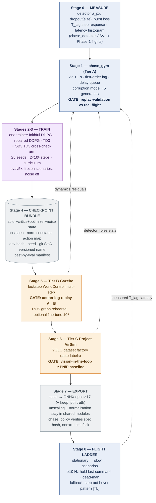

# Offline Training — References, the 2026 Survey, and the End-to-End Recipe

**What this file is.** The consolidated answer to: *how do we train the chase agent offline in
simulation and get deployable weights into the pipeline of
[rl_block_diagram.md](rl_block_diagram.md)?* It was produced from three verification passes run
in parallel on 2026-09-16 — two reference codebases **cloned and read with line numbers**, one
deep web survey where **every reported claim was fetched and read at its primary source** — on
top of the existing doc set. Nothing here changes the algorithm specification
([rl_specification.md](rl_specification.md), [rl_training_guide.md](rl_training_guide.md) Part
III) or the three-tier simulator architecture
([sim_training_architecture.md](sim_training_architecture.md)); it adds external evidence,
forces **two corrections** (§8), and consolidates the recipe (§7).

**Evidence tags**, extending the doc-set convention ([P] paper · [C] its published code ·
[V] verified in this repo / recomputed · [D] design decision):

| Tag | Meaning |
|---|---|
| **[TL]** | verified in `aqeelanwar/DRLwithTL_real` @ `b61ecb7` (last commit 2020-07-30) and `aqeelanwar/DRLwithTL` @ `8255135` (2021-01-22), both MIT — cloned and read 2026-09-16, cited `file:line` |
| **[GG]** | verified in `AcutronicRobotics/gym-gazebo2` (Apache-2.0, **archived**, last push 2019-07-04; raw files read 2026-09-16) or in arXiv:1903.06278v2 itself |
| **[N2]** | verified in `reiniscimurs/DRL-Robot-Navigation-ROS2` @ `216a23a` (2025-01-30 — same commit as the existing analysis; repo unchanged upstream). Supplements [drl_ros2_reference_analysis.md](drl_ros2_reference_analysis.md); does not repeat it |
| **[W]** | web fact verified 2026-09-16 by fetching and reading the cited URL (repo statuses via the GitHub API `pushed_at`/`archived` fields) |

Contents: 1 short answer · 2 reference identity · 3 DRLwithTL_real · 4 gym-gazebo2 ·
5 DRL-Robot-Navigation-ROS2 supplement · 6 the 2026 survey · 7 the recipe · 8 corrections and
additions · 9 verification record.

---

## 1. The short answer

Offline training = **Tier A does the learning, Tiers B/C do the certifying, one contract binds
them, and the weights travel as an auditable bundle**:

1. **Measure first** (Phase 0/1): detector jitter/dropout statistics from `chase_detector`
   CSV logs, the follower's velocity-lag constant `T_lag` from a step-response flight, the
   latency distribution (150–350 ms already measured [V]). These numbers *are* the simulator's
   parameters — nothing is defaulted.
2. **Build and validate `chase_gym`** (Tier A, [rl_training_guide.md §16](rl_training_guide.md)):
   image-plane kinematics + first-order lag + a delay queue fed by the measured latency +
   detector corruption + five target-motion generators. Gate: replay a real flight's command
   log; the simulated box track must match the recorded YOLO track within detector jitter.
3. **Train three arms × ≥5 seeds** with the one TD3/DDPG trainer
   ([rl_training_guide.md §13.5](rl_training_guide.md)): faithful DDPG (the paper-code's exact
   configuration [C]), repaired DDPG, TD3 — ~2×10⁵ env steps per run, curriculum
   static → aggressive, eval every 5 000 steps on frozen scenarios with noise off.
4. **Checkpoint as a contract, versioned**: weights + observation spec + normalisation
   constants + action map + env-config hash + seed + git SHA
   ([rl_training_guide.md §19](rl_training_guide.md)), with step-and-score in the filename and
   best-by-eval selection recorded in a manifest (§7 stage 4 — the [N2] counterexample is why).
5. **Certify**: Tier B (Gazebo Harmonic/Jetty, true lockstep via `WorldControl` multi-step)
   validates dynamics and rehearses the unchanged ROS 2 graph; Tier C (Unreal — **now Project
   AirSim, §6.3**) runs real YOLO on rendered frames, closed loop, against the PN/P-controller
   baseline.
6. **Export the actor alone** — ONNX (opset ≥ 17) or TorchScript — while observation
   normalisation and the [−1,1]→stick mapping stay in the *shared modules* the node imports;
   `chase_policy` verifies the bundle's observation spec and runs `onnxruntime` per tick.
   Then the flight ladder.

Everything below is the evidence; §7 is the full recipe with gates.

---

## 2. Reference identity — a correction for the record

The three externally-suggested references resolve as follows:

| Cited as | Actually is | Status |
|---|---|---|
| `github.com/aqeelanwar/DRLwithTL_real` | Real-Tello *online* fine-tuning companion of the AirSim/Unreal sim repo `DRLwithTL`; the pair's paper is **arXiv:1910.05547** (Anwar & Raychowdhury, 2019-10-12, only version) [TL `README.md:77-92`; W abs page] | analysed, §3 |
| `arxiv.org/html/1903.06278v2` | **Not** the DRLwithTL paper — it is **“gym-gazebo2, a toolkit for reinforcement learning using ROS 2 and Gazebo”** (Lopez et al., Acutronic Robotics; v2 2019-03-18) [W abs page] | analysed as its own reference, §4 |
| `github.com/reiniscimurs/DRL-Robot-Navigation-ROS2` | already verified in [drl_ros2_reference_analysis.md](drl_ros2_reference_analysis.md); unchanged upstream since that read [N2] | supplemented, §5 |

Related-work note found on the way [W Crossref]: the chase paper's authors have a 2023
predecessor — Tan & Karaköse, *“A new approach for drone tracking with drone using Proximal
Policy Optimization based distributed deep reinforcement learning”*, SoftwareX 23 (2023)
101497 — i.e., the group tried PPO before DDPG. Worth citing in the proposal's related work.

---

## 3. Reference — DRLwithTL_real (+ DRLwithTL, arXiv:1910.05547)

**What it is** [TL]: transfer-learning DRL *navigation* (obstacle avoidance), not tracking.
A dueling **Double-DQN** — AlexNet conv stack (ImageNet-initialised) + dueling FC streams —
with prioritized replay and epsilon-greedy, observing raw 227×227 RGB frames. **Discrete**
actions: 25 direction bins in sim, 3 on the real Tello (forward / yaw-left / yaw-right at 40 %
stick) [TL `configs/config.cfg:12`, `tellopy/tello_drone.py:181-190`]. **It is not DDPG and not
continuous control** — it informs our *workflow*, never our algorithm.

**Its offline training** happens in the sim repo on Microsoft AirSim + Unreal
[TL `DRLwithTL/main.py:84-228`]: no episodes of fixed length (fly-until-crash), reward from a
ground-truth depth camera, PER buffer 60 000, prefill 30 000 steps, train every 3rd iteration,
batch 32, Adam 1e-6, γ 0.99, ~300 k iterations ("8–12 h on a GTX1080" per its README). Two
facts matter for us:

1. **Training "flight" is teleportation** — `simSetVehiclePose` 0.4 m per action, dynamics only
   at inference [TL `network/agent.py:155-178`]. Zero dynamics, zero latency in training: the
   exact gap our Tier A latency queue + lag model and Tier B physics close.
2. **The real drone runs *online* RL** (gradients during flight on the laptop), with safety by
   *virtual crash*: monocular-depth (FCRN) threshold → reward −1 + scripted reverse-and-hover
   recovery; pygame manual override every cycle; any exception → land
   [TL `main_code.py:118,152-163,254-266`]. Our plan deliberately keeps **all learning
   offline** — this repo is the existence proof of the alternative and of its machinery cost.

**The transfer-learning mechanism** — freeze ImageNet/sim conv features, fine-tune last-N FC
layers [TL `network/network.py:13-30`] — **has no analogue for us**: our observation is already
a bounding-box abstraction; there are no perceptual layers to transfer, and our sim-to-real gap
lives in *dynamics and latency*, not appearance. Their pixel pipeline needed 30 k prefill +
150–300 k iterations + GPU-hours for a task our abstraction reduces to a ~90 k-parameter MLP
problem — their numbers are the argument *for* the abstract observation
[[rl_specification.md §3](rl_specification.md)], not a recipe.

**Patterns worth taking** [TL]:

- **Step-act-hover under latency**: apply the action 0.8 s, zero sticks, hover 0.4 s, decide
  again — plus skipping `int(elapsed×60)` decoded frames per cycle so each decision sees a
  fresh, quasi-static observation [`main_code.py:100-107,179-182,248-250`]. Recorded as the
  **fallback control pattern** if 150–350 ms breaks continuous 10 Hz control (§7 stage 8).
- **Dual save format**: TF1 checkpoints for resume plus a framework-portable all-arrays dump
  (`weights.npy`, defined `agent.py:842-857` — ironically never called). Our
  torch-state-dict + ONNX pair (§7 stage 7) is the same idea, actually wired.
- **Identical train/deploy graphs or nothing transfers**: their sim (25-action) and real
  (3-action) networks differ in the head, loading is full-graph restore only — a sim
  checkpoint *cannot* load on the real graph as shipped. Our shared-module + spec-hash
  checkpoint contract [guide §19] is the structural fix.

**Code-quality audit** (the by-now-familiar pattern): as shipped the real repo cannot execute
its published protocol — `train_type` hardcoded to `e2e` (`main_code.py:51,60`),
`custom_load: False` (no transfer at all), the Adam lr read from the *dropout* config field
(`configs/read_cfg.py:41`), and a `Memory.save` TypeError that lands the drone at iteration
100 (`main_code.py:219` vs `DeepNet/util/Memory.py:37`). Same paper↔code divergence class the
doc set found in the chase paper [[rl_block_diagram.md §7](rl_block_diagram.md)] — trust
mechanisms, not repos, and keep auditing ours.

---

## 4. Reference — gym-gazebo2 (arXiv:1903.06278v2)

The toolkit paper behind the link: PPO on the MARA 6-DoF arm, ROS 2 Dashing + **Gazebo
classic 9**, repo archived since 2019-07-04 [GG]. It is the closest published precedent for
Tier B's claim — continuous-action RL trained against ROS 2 + Gazebo to millimetre accuracy —
and its *mechanics* are exactly what Tier B must do better:

| gym-gazebo2 did [GG] | Tier B does instead | Why |
|---|---|---|
| Env **is** an rclpy node that launches gzserver itself in `__init__` and kills the process tree in `close()` (`mara.py:66-73,378-385`) | same pattern, on `ros_gz` | still the right shape; every underlying API changed |
| **Free-running sim + stamp gating**: publish action, then spin until an observation stamped after the publish (`mara.py:238-243,313`) — with a non-monotonic `str(sec)+str(nanosec)` compare bug | **true lockstep**: paused `WorldControl` multi-step, exactly 100 × 1 ms per 0.1 s control period [S3, [sim_training_architecture.md §3.4](sim_training_architecture.md)] | stamp gating guarantees obs-after-*publish*, not obs-after-*effect*; latency becomes an accident of host scheduling instead of an injected, measured quantity |
| **Two-world speed trick**: training world with `real_time_update_rate = 0` (unthrottled, CPU-bound), separate real-time world + URDF for evaluation, `--realSpeed` switch (`ut_launch.py:135-140`) | **adopt** [D → §8] | the cheapest sim speedup there is; lockstep already decouples us from wall clock, unthrottling lets the fine-tune arm run faster than real time |
| Whole-sim reset service + fresh gated observation; fixed 1024-step episodes, collision → mid-episode reset | world reset + `set_pose`, natural termination (target lost / capture) | fixed-length-with-hidden-resets muddies returns; chase has natural terminals |
| Per-instance isolation via `ROS_DOMAIN_ID` + `GAZEBO_MASTER_URI` | `ROS_DOMAIN_ID` + `GZ_PARTITION` | same idea, current mechanism |

**Ecosystem verdict** [W]: gym-gazebo2 and its ros2learn companion — archived 2019;
`gym-ignition` (the conceptual successor with programmatic stepping) — moved to
`robotology-legacy`, README states development stalled (last push 2024-01-04); **only `ros_gz`
is active** (pushed 2026-09-15). **There is no maintained off-the-shelf Gym-for-gz-sim toolkit
in 2026** — Tier B's thin bespoke `GzChaseEnv` is not a preference but the only current path.
Cite gym-gazebo2 as the architectural pattern, not as reusable software. Meanwhile gz-sim
itself moved toward us: see §6.3.

---

## 5. Reference supplement — DRL-Robot-Navigation-ROS2, the training workflow

[drl_ros2_reference_analysis.md](drl_ros2_reference_analysis.md) already covers the
architecture, defects, and transferability. The new pass [N2] pinned the *offline-training
workflow* facts it left open — each one is a rule for our trainer, mostly by counterexample:

| Finding [N2] | Rule for us |
|---|---|
| Their "step" is **wall-clock**: `unpause → time.sleep(0.1) → spin_once → pause` (`ros_python.py:53-55`), sim time never read; on a loaded host the physical step silently shrinks | Tier B steps physics explicitly (lockstep); Tier A is discrete-time by construction; every transition can carry its true sim-Δt |
| **Checkpointing**: overwrite-in-place `state_dict` files every ~200 episodes, no best-model selection, no optimizer/temperature state, no `map_location` — and a default run **crashes at its first save** because `models/` is never created (verified empirically); no deploy/eval script exists at HEAD | versioned checkpoint filenames (step + eval score), best-by-eval manifest, optimizer + noise state included for resume, `map_location='cpu'` on load, and the deploy loader is a first-class deliverable (§7 stages 4, 7) |
| **Seeding**: only Python's `random` (via the buffer); numpy/torch never — `set_seed_everywhere` exists with zero call sites | seed python/numpy/torch per run, log the seed in the bundle [guide §19 already; now with a named counterexample] |
| **No warmup guard**: prefill is 100 % demonstrations, and `sample_batch` silently trains on fewer than `batch_size` samples if the buffer is short | keep the demonstration prefill [guide §17] **plus** a minimum-buffer guard before the first gradient step |
| Exploration noise constant 0.2, **no decay**; TD3 exploration was entirely broken (clip-to-constant bug) until the repo's final commit `07419f5` (2025-01-30) — pre-2025 results seen anywhere were SAC | our σ schedule (0.3 → 0.05) stands [guide §15]; and re-verify exploration *output* histograms in week one — the reference's bug class is "noise silently absent", which our §5.2 finding shows the *original chase code* also had |
| **No convergence criterion or duration claim anywhere** — training just stops at 100 epochs (~7 000 episodes) | adopt their eval-curve trio (avg return / collision→**loss** rate / goal→**time-in-view** rate on frozen scenarios) and define an explicit stopping rule (§7 stage 3) |
| RL core cleanly ROS-free, env hard-bound to live Gazebo; quad swap = ~5 env-side files | confirms the [guide §15] layout and the Tier-B shim plan |

---

## 6. The 2026 survey — what confirms the plan, and what changes it

### 6.1 Tello sim-to-real precedents — the proven pattern

Every system that reached real Tello hardware follows one shape [W, each fetched and read]:

| System | Sim | Algorithm / obs | Deployment | Result |
|---|---|---|---|---|
| Tan & Karaköse 2025 [P][C] | point-mass Gym | DDPG on bbox centre | keras-rl weights, off-board | the baseline we reproduce |
| `rkassana/tello-rl-yolo` (2019) [W] | **none** | keras-rl DDPG on YOLOv3 box, live | pre-trained agent straight onto the drone | no reported results — the no-sim-tier null case |
| DRLwithTL_real [TL] | AirSim/Unreal (teleport) | DDQN on raw pixels | online RL on the real Tello | qualitative only |
| CTS swarm search, arXiv:2204.12181 [W] | Unity ML-Agents | PPO-family, 529-d encoded obs | **PyTorch → ONNX → ONNXRuntime**, off-board, ≥20 fps | sim 75.4 % → real 48 %; failures: "image blur and loss of the video stream" |
| AMS-DRL pursuit-evasion, arXiv:2304.03443 [W] | Unity | self-play, 4-d body-velocity + yaw actions | off-board, Tello Edu, 189 physical tests | **real 39.2 % ≈ sim 37.1 %** |
| GaussFly, arXiv:2604.05062 (2026) [W] | 3D-Gaussian-splat real-to-sim | PPO on frozen-encoder features | **ONNX**, Tello Edu | 80 % reconstructed / 65 % unseen scene |

Read together: **train off-board in sim on low-dimensional or encoded features → export
(ONNX) → off-board inference → SDK velocity commands.** Nobody runs learning on the drone;
nobody reports success with raw-pixel policies on a Tello; the 2026 state of the art in
formulation (arXiv:2609.09234, PPO in Isaac Lab) converged on exactly our observation family —
normalized image offsets + relative depth — and the vision-for-drones survey
(arXiv:2312.05019v2) states the modular detector-first pipeline generalizes better than
end-to-end. **Our architecture is the consensus architecture.** The CTS failure mode (blur +
video-stream loss) names what our detector-dropout corruption must include: *burst* loss, not
only per-frame dropout.

### 6.2 Latency — the danger zone is measured in steps, and our remedies are the literature's

The delayed-RL literature quantifies what [rl_specification.md §9](rl_specification.md)
asserted [W, all primary sources read]:

- Benchmarks degrade sharply with delay Δ counted **in control steps**: a state-augmented MLP
  falls −62 % from Δ=5 to Δ=20 on HalfCheetah (arXiv:2507.18992, with numbers); world-model
  agents conditioning on *(delayed state + pending actions)* were the most robust family
  across Δ ∈ {2,5,10,20} (arXiv:2403.12309); random-delay MDPs formalize the resampling
  (arXiv:2010.02966); RTAC the act-while-computing step (arXiv:1911.04448).
- **Our regime**: 150–350 ms at Δt = 0.1 s is **Δ ≈ 1.5–3.5 steps** — tolerable *with*
  remedies. At 20 Hz it would be Δ ≈ 3–7 — inside the visible-degradation zone. **This
  arithmetic confirms the 10 Hz control period and argues against ever "helpfully" raising
  it** [D confirmed].
- **The action-history observation is hardware-proven with TD3**: "Learning to Fly in Seconds"
  (arXiv:2311.13081, RA-L) — real Crazyflie, chose TD3 over PPO, motor lag RC constant 0.15 s,
  actions bite 5–25 steps later, and the stated mitigation is *append the recent action history
  to the actor's observation*. That is precisely the k = 4 pairs of
  [rl_training_guide.md §4.3/§18](rl_training_guide.md) — now with an external existence proof
  on hardware.
- **Randomization alone is insufficient — observe the delay** (Time-in-State RL, CoRL 2020,
  PMLR v155): adding the *measured* delay and sampling rate to the observation beat pure
  randomization on a physical testbed. Our `DroneDetection` already carries `t_capture` and
  `t_receive` [V msg definition] — the observation age is available **for free**. Recorded as
  an ablation arm, not a default (§8) — the observation spec stays stable for the main matrix.
- **The counterpoint that keeps us honest** (SimpleFlight, arXiv:2412.11764): in a *low-latency
  onboard* regime, DR on well-calibrated parameters was counterproductive and previous-action
  in the obs slightly hurt. Reconciliation: **calibrate what you can measure (T_lag, latency
  distribution), randomize only the residual** — which is exactly the ±30 % jitter policy
  already in [guide §16.1] — and action history earns its place only because our
  delay-in-steps is significant. It is.
- Detector-noise modelling precedent (Swift, Nature 2023): fit residual models from real
  perception traces and replay them in sim — our Phase-0 plan, with a Nature-grade citation.

### 6.3 Simulator landscape 2026 — one correction, one green light

All statuses read from the repos/API on 2026-09-16 [W]:

| Tool | Status | Consequence |
|---|---|---|
| **Colosseum** | **ARCHIVED 2026-07-11** (banner verified; main targets UE 5.6) | **Tier C default changes → Project AirSim**; Colosseum only as pinned-commit fallback. [sim_training_architecture.md §4](sim_training_architecture.md) updated in place |
| **Project AirSim** (`iamaisim/ProjectAirSim`) | open-sourced 2025-05-15 (MIT; Microsoft + IAMAI announcement in microsoft/AirSim discussion #5024), pushed 2026-09-16 | the active AirSim-lineage UE engine — Tier C default [D] |
| `microsoft/AirSim` | `archived: false`, pushes through 2026-09-15 — but **no formal un-archival announcement found** | treat as ambiguous; do not build on it |
| **gz-sim** | Harmonic LTS (EOL 2029) / Jetty LTS (EOL 2031) [S1 confirmed]; RL meta-issue #2662 open; **official SB3 example + public Reset API merged 2025-05-28 (PR #2667)**; ROS 2 `simulation_interfaces` now expose `ResetSimulation`/`StepSimulation`/`SetEntityState` (caveat: SetEntityState writes pose *and* twist together); `MulticopterVelocityControl` + `LeeVelocityController` confirmed in `gz-sim9` | Tier B green light — the platform is moving toward RL, and the reset/step services give `GzChaseEnv` a supported API surface |
| `ros_gz` | active, pushed 2026-09-15 | Tier B transport, as planned |
| gym-pybullet-drones | active (pushed 2026-09-06; gymnasium + SB3 ≥ 2.0) | a credible Tier-B *alternative* if Gazebo friction ever exceeds its value — but no bbox task, and Gazebo keeps the ROS-graph rehearsal role |
| Flightmare | stale (2024-06-14) | rejected |
| Isaac corner (Pegasus 2026-08-07 · Aerial Gym 2026-06-28 · OmniDrones 2026-01-20 · Isaac Lab quadcopter task) | active, GPU-first | not needed at our scale (~90 k params, CPU-trainable); revisit only for massive-parallel curricula |
| `RobotX-Workshops/tello-sim` | educational djitellopy-API mirror, pushed 2026-08-29 | possible HIL mock of the *driver API* in unit tests; not a training sim |

### 6.4 Trainer implementation — the hand-rolled trainer stays, SB3 becomes the cross-check

[W, SB3 docs + PyPI read]: stable-baselines3 is at **2.9.0** (Python ≥ 3.10), its **DDPG is
literally TD3 with the tricks disabled** ("they share the same policies and same
implementation"), TD3 defaults are lr 1e-3 / buffer 1e6 / batch 256 / τ 0.005 /
policy_delay 2 / target noise 0.2 clip 0.5, and the RL-Zoo's closest calibrated config
(Pendulum: 20 k steps, buffer 2e5, γ 0.98, Gaussian noise 0.1, net [400,300]) is the nearest
tuned reference for a tiny observation space. CleanRL's TD3 documents the classic trap our
±60 mapping must respect: action scale/bias handled explicitly, never assumed [−1,1].

**Decision [D]:** the hand-rolled trainer of [guide §11.7/§13.5] remains primary — it is the
only way to reproduce the faithful arm's keras-rl quirks exactly (OU-with-dt semantics, τ per
gradient step, 16³ nets, raw-pixel obs) and it keeps the checkpoint contract native. **Added:**
one **SB3 2.9.0 TD3 run** on the identical `chase_gym` env as an *external-implementation
check* — config-only cost; if custom-TD3 and SB3-TD3 agree within seed variance on the eval
suite, implementation error is largely excluded (the same null-baseline philosophy as the
P-controller, applied to the trainer itself). Report both; tune neither on the other.

Evaluation reporting [W]: adopt **rliable** (Agarwal et al., NeurIPS 2021) — IQM + stratified
bootstrap CIs + performance profiles over the ≥5 seeds — the field's answer to exactly the
Henderson critique the guide already cites [§24].

### 6.5 Weights → deployment — the export pitfalls, verified

From SB3's own export documentation [W] — and they apply equally to any torch export:

1. Exported actors emit **normalized [−1,1] actions**: clipping and unscaling are *not* in the
   graph. The [−1,1] → ±60 → stick mapping must live in the node (our `chase_mixer` already
   owns it [implementation_plan.md]).
2. **Observation normalization is not embedded** (VecNormalize or ours): the node must apply
   the same constants — which is what the shared observation-assembly module guarantees
   structurally [guide §21].
3. ONNX: export `policy.actor` (off-policy algos), `deterministic=True`, **opset ≥ 17**;
   TorchScript path: `jit.trace → freeze → optimize_for_inference`.

Precedent for ONNX-in-a-ROS-2-node on this exact aircraft class: CTS and GaussFly both run
plain Python `onnxruntime` off-board for Tello Edu fleets at ≥ 20 fps [W §6.1]; a 2-in/2-out
(with history, ~14-in) MLP needs nothing more. `ms-iot/ros_msft_onnx` is archived (2024-02-14)
— do not build on it [W]. The torch `state_dict` bundle remains the source of truth; ONNX is a
derived artifact regenerated at promotion time (§7 stage 7).

---

## 7. The recipe, end to end

The weight lifecycle, with every gate named:

**Stage 0 — measure (nothing is defaulted).** Detector statistics from real Tello video
through `chase_detector` (per-frame CSV already implemented [V]): centre jitter σ_px, dropout
vs box size, **and burst-loss statistics** (the CTS failure mode, §6.1). `T_lag` from a
step-response flight; latency from the measured 150–350 ms distribution plus per-frame
`t_receive − t_capture`. Output: one corruption-model file + one dynamics file, versioned —
they parameterize Tier A and the Tier-B oracle.

**Stage 1 — build Tier A and validate it.** Exactly [guide §16]; the gate is the §16.3
replay-validation (real command log → simulated box track vs recorded YOLO track, median error
within detector jitter). *An unvalidated simulator invalidates everything downstream.*

**Stage 2 — trainer.** [guide §13.5]'s one TD3 class with flags → arms F (faithful: the [C]
configuration verbatim, including its OU-noise semantics and raw-pixel obs), R (repaired DDPG),
T (TD3, the expected winner) + the SB3 cross-check arm (§6.4). Buffer prefill from the
P-controller demonstrations with rewards recomputed on load [guide §17], **plus a
minimum-buffer guard** [N2]. Seed python/numpy/torch; log everything [N2].

**Stage 3 — runs.** ≥5 seeds × 4 arms × ~2×10⁵ env steps; curriculum
static → constant-v → oscillations → aggressive, advancing on eval time-in-view > 90 %
[guide §20]. Eval every 5 000 steps: ≥10 episodes per scenario family, exploration off, frozen
eval seeds; dashboard per [guide §23] + the eval trio adapted from [N2] (return /
time-in-view % / loss rate). **Stopping rule [D]**: budget exhausted *or* eval-IQM plateau
(no improvement across 5 consecutive evals) after curriculum completion. Report IQM +
stratified bootstrap CIs (rliable).

**Stage 4 — checkpoints.** The [guide §19] contract, hardened by the [N2] counterexamples:
filename `td3_s{seed}_step{n}_tv{score}.pt`; bundle adds optimizer and noise-process state
(resumability); a `best.json` manifest records the selected checkpoint per arm and *why*
(eval metric, not recency); loads always `map_location='cpu'`.

**Stage 5 — Tier B.** [sim_training_architecture.md §3] verbatim — lockstep
`WorldControl` multi-step (100 × 1 ms per control period), the `tello_sim_shim`, the oracle
detector projecting with **our** calibration, the sign-test protocol first. Plus the [GG]
two-world trick: unthrottled physics for the fine-tune arm, real-time world for evaluation.
Gates: identical-action-log replay A↔B within tolerance; full ROS-graph rehearsal including
dead-man; then the optional 10⁴-step fine-tune arm, reported separately.

**Stage 6 — Tier C.** As specified in [sim_training_architecture.md §4] with the engine
swapped to **Project AirSim** (§6.3): dataset factory with segmentation-derived auto-labels
mixed with real captures → fine-tuned YOLO (the `chase_detector` node is weights-agnostic
[V README]); vision-in-the-loop closed-loop evaluation; promotion requires ≥ the PN/P-controller
baseline under real YOLO noise.

**Stage 7 — export and deploy.** From the winning bundle: export the **actor alone** to ONNX
(opset ≥ 17, deterministic); regenerate on every promotion, keep the `.pth` as truth. The node
(`chase_policy`) imports the *same* observation-assembly and action-mapping modules as
training (skew structurally impossible [guide §21]), verifies the bundle's observation-spec
hash, refuses on mismatch, and runs one `onnxruntime` forward pass per tick — microseconds at
this size [V-scale]. Publishing: ≥ 10 Hz, hold-last-command, driver dead-man 0.35 s — never
the original's pulse-and-zero [C].

**Stage 8 — flight ladder.** [implementation_plan.md Phase 4]: sim → stationary → slow →
scenarios, manual override live. If continuous 10 Hz control proves latency-fragile despite
the delay-aware training, the recorded fallback is the [TL] step-act-hover pattern — degrade
the *control schedule*, not the safety envelope.

**Budget** (estimates to revise against curves, flagged as such): Tier A steps are
point-kinematics-cheap (the original trained 10⁵ steps of a smaller net in ~4 h on an i5 CPU
[P App. A]); ours is ~90 k parameters × 2×10⁵ steps — CPU-hours per run, seeds in parallel
[guide §20]. Tier B fine-tune 10⁴ lockstep steps; Tier C is batch rendering + evaluation, not
gradients.

---

## 8. Corrections and additions this survey forces

**Corrections applied in place:**

1. **Tier C engine**: Colosseum archived 2026-07-11 → default is **Project AirSim** (fallback:
   Colosseum pinned to a commit). UPDATE note added to
   [sim_training_architecture.md §4](sim_training_architecture.md). [W]
2. **Reference identity, for the record**: arXiv:1903.06278 = gym-gazebo2 (analysed §4);
   DRLwithTL's paper = arXiv:1910.05547. No earlier doc cited these wrongly; recorded here so
   the proposal's bibliography starts correct. [W]

**Confirmations (no change needed — now with named external evidence):**

- k = 4 action-history observation ← TD3 + action history flew a real Crazyflie under
  0.15 s actuation lag (arXiv:2311.13081) — §6.2.
- Δt = 0.1 s / 10 Hz control ← delay-benchmark arithmetic puts 20 Hz in the degradation zone —
  §6.2.
- Error-vector observation, not pixels ← every deployed Tello precedent + the 2026
  formulation papers + the survey's modular-beats-end-to-end verdict — §6.1.
- Tier-B lockstep via WorldControl ← both references' sync mechanisms are the cautionary
  tales (free-run + stamp-gating [GG]; wall-clock sleep [N2]) — §4, §5.
- Calibrate-then-randomize-the-residual ← SimpleFlight vs TSRL reconciliation — §6.2.
- The checkpoint contract ← [N2]'s checkpoint lifecycle is the complete counterexample — §5.

**Additions [D], adopted in §7:** SB3 2.9.0 TD3 cross-check arm · versioned checkpoint
filenames + best-by-eval manifest + optimizer/noise state in the bundle · minimum-buffer guard
· burst-loss in the detector corruption model · unthrottled-train / real-time-eval world split
in Tier B · rliable (IQM + CIs) reporting · step-act-hover as the recorded latency fallback.

**Ablation candidates recorded, not defaults:** observation-age as an extra input (TSRL-style;
`t_capture`/`t_receive` already in `DroneDetection` [V]) · net_arch sweep below [256,256]
(the Zoo's [400,300] Pendulum net argues ours is already generous).

---

## 9. Verification record

| Artifact | Method | What it pinned down |
|---|---|---|
| `aqeelanwar/DRLwithTL_real` @ `b61ecb7` + `DRLwithTL` @ `8255135` | cloned, read with line numbers | §3 in full: DDQN identity, teleport training, TL mechanism, Tello interface, 7 paper↔code discrepancies |
| arXiv:1910.05547 abs + ar5iv | fetched | the repos' actual paper (title, authors, date); method claims (summarized fetch, flagged) |
| arXiv:1903.06278 abs + html/v2 | fetched | gym-gazebo2 identity (Lopez et al., v2 2019-03-18); architecture claims |
| `AcutronicRobotics/gym-gazebo2` (`mara.py`, `ut_launch.py`, worlds, README/INSTALL) | raw files read | §4 mechanics: launch-in-init, stamp gating + its bug, two-world trick, reset; archived status |
| `reiniscimurs/DRL-Robot-Navigation-ROS2` @ `216a23a` | cloned, read; two facts verified *empirically* (first-save crash; state_dict keys) | §5 in full |
| Tello precedents (CTS 2204.12181v3 · AMS-DRL 2304.03443v2 · GaussFly 2604.05062 · rkassana/tello-rl-yolo) | each fetched | §6.1 table incl. sim-vs-real numbers and failure modes |
| Delay-RL canon (1911.04448 · 2010.02966 · 2403.12309 · 2507.18992 · TSRL PMLR v155 · 2311.13081 · 2412.11764 · Swift PMC) | each fetched | §6.2 in full, incl. the −62 % Δ5→Δ20 figure and the TD3+history hardware proof |
| Simulator statuses (Colosseum · ProjectAirSim · microsoft/AirSim · gz-sim releases, issue #2662, PR #2667, `simulation_interfaces` docs, multicopter_control tree · ros_gz · gym-pybullet-drones · Flightmare · Pegasus · Aerial Gym · OmniDrones · tello-sim) | GitHub API + pages, 2026-09-16 | §6.3 table |
| SB3 (PyPI json, td3/ddpg module docs, export guide) · RL-Zoo `td3.yml` raw · CleanRL td3 docs · rliable 2108.13264 | each fetched | §6.4–6.5: versions, defaults, DDPG=TD3 identity, export pitfalls, Zoo config, evaluation protocol |
| Crossref + DOAJ APIs | queried | chase-paper bibliographic identity; the 2023 PPO predecessor (SoftwareX 23:101497) |
| This repo: `chase_msgs/DroneDetection.msg`, `chase_detector` README/tree, doc set | read | the deployed contract the recipe plugs into; everything cited as [guide §n]/[spec §n] |

**Not verified, explicitly:** full ScienceDirect text of the 2025 chase paper (403; our local
PDF + cloned code remain the authority) · liveness of DRLwithTL's external weight downloads ·
whether microsoft/AirSim was formally un-archived (state observed, announcement not found) ·
quantitative delay-sweep curves *specifically* for TD3 (the delay benchmarks use SAC-family
baselines; the TD3-under-delay evidence is the Crazyflie system's success, not a sweep) ·
ar5iv fetches are summarized, not line-verified, where so flagged.
