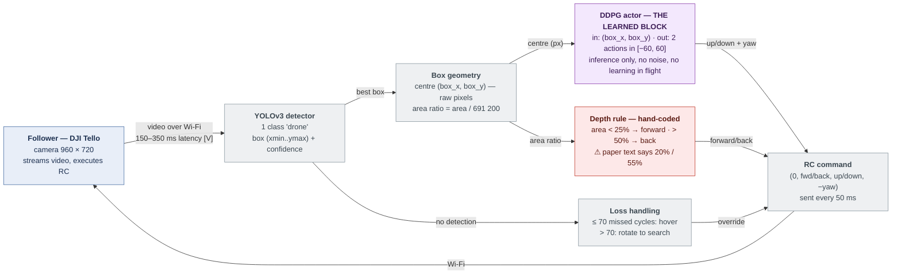
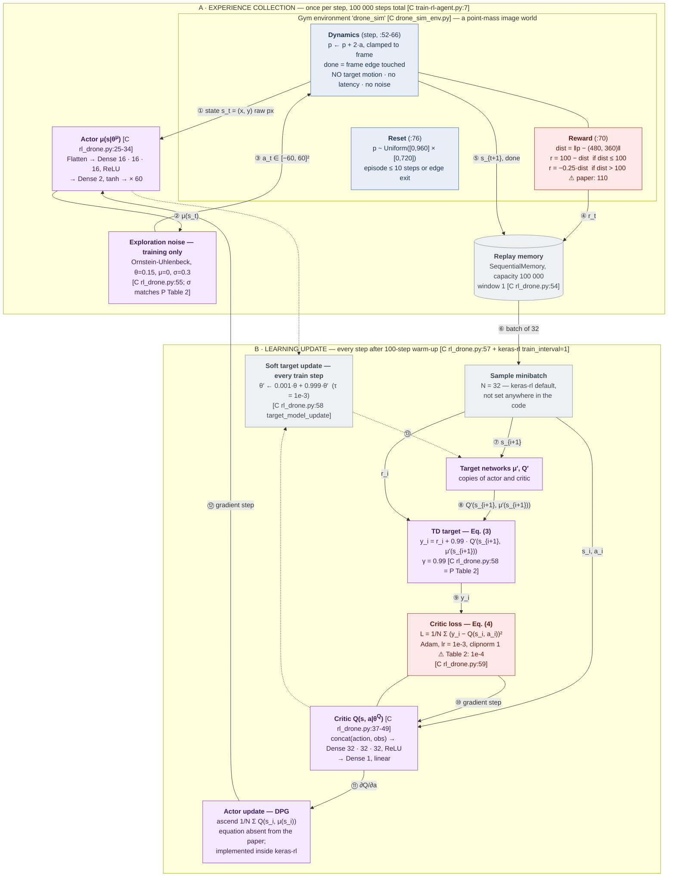
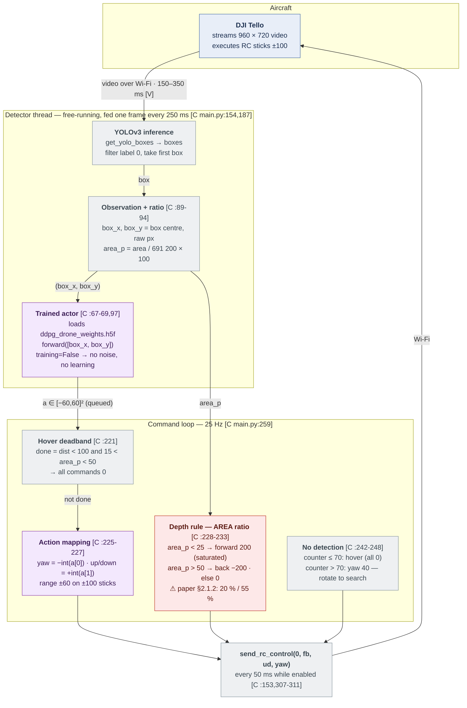

# The RL Pipeline, Verified — Block Diagrams from the Paper and its Published Code

This document is the detailed, verified block diagram of the reinforcement-learning pipeline —
training and deployment — for the drone-chasing-drone approach. It supersedes the "not
specified" markers in [block_diagram.md §3](block_diagram.md#3-ddpg-internals-and-the-training-loop-p-§222):
every one of those gaps is now **resolved from the paper's own published implementation**, which
was fetched and read for this document.

**Sources, and a new evidence tag.** In addition to the doc-set tags — **[P]** paper (Tan &
Karaköse, SoftwareX 31 (2025) 102201, section cited), **[V]** verified in this repository or
against the manufacturer, **[D]** design decision of this plan — this document introduces:

> **[C]** = verified in the paper's published code, `github.com/ziya44/Drone_tracking_with_drone`
> (named in the paper's metadata entry C3, MIT licence), at commit `840487e` (2025-02-10),
> cloned and read on 2026-09-11. Citations are `file:line` in that repository.

The code is the ground truth for what was actually trained and flown, and it turns out to
**contradict the paper's text in five places** (§7 below). Where they disagree, the diagram shows
the code's value and flags the conflict with ⚠.

Contents:
1. [Verification record](#1-verification-record)
2. [Where the RL sits — the closed loop](#2-where-the-rl-sits--the-closed-loop)
3. [Block diagram — training](#3-block-diagram--training)
4. [The training loop, step by step](#4-the-training-loop-step-by-step)
5. [The reward function, exactly](#5-the-reward-function-exactly)
6. [Block diagram — deployment](#6-block-diagram--deployment-inference-only)
7. [Paper ↔ code discrepancies](#7-paper--code-discrepancies)
8. [Ambiguities resolved by the code](#8-ambiguities-resolved-by-the-code)
9. [What this changes for our implementation](#9-what-this-changes-for-our-implementation)

---

## 1. Verification record

| Artifact read | What it pinned down |
|---|---|
| Paper PDF, all 13 pages re-read (text extracted with `pypdf`) | §§2.1–2.2.4, Eqs. (1)–(6), Tables 2–5, Table A.1, Appendix A — all quotes in this doc set re-confirmed against the primary source |
| `agents/drone_sim_env.py` (127 lines) | The actual Gym training environment: spaces, dynamics, reward, termination, reset |
| `agents/rl_drone.py` (59 lines) | The actual DDPG agent: networks, buffer, noise process, τ, warm-up, optimiser, seed |
| `agents/train-rl-agent.py` (13 lines) | The actual training run: `fit(nb_steps=100000, nb_max_episode_steps=10)` |
| `main.py` (~320 lines) | The actual deployment loop: observation construction, action mapping, depth rule, search behaviour, timing |
| `agents/drone_real_env.py` | Mirror of the sim env with `update_state()`; **not imported by `main.py`** — vestigial |
| `keras-rl` `rl/agents/ddpg.py`, `rl/core.py` (the library the code uses) | Defaults the code inherits silently: batch 32, train every step, soft target updates; `training=False` outside `fit()` — so no exploration noise in flight |

Method note: the GitHub repository was first read via web fetch and then **shallow-cloned and
read locally with line numbers**; the two reads agree. All derived numbers in this document
(reward branch values, 600-px corner distance, threshold geometry, standoff distances) were
recomputed with Python for this document, not copied.

---

## 2. Where the RL sits — the closed loop

The learned policy is one block inside a hand-built perception–control loop. Everything below is
the *published* system; green marks what this repository already provides.



The RL problem proper is only the purple block. Its **entire interface** is: two raw pixel
coordinates in, two bounded velocity corrections out, once per detection. Depth (forward/back)
never passes through the policy, and the reward that trained the policy never sees the box size —
the split the paper states in §1 is exactly what the code implements
[C `main.py:225-233`, P §1].

---

## 3. Block diagram — training

This is the pipeline that produced the deployed weights. It ran entirely offline — ≈ 4 h on a
CPU-only Intel i5 [P §2.2.4, Appendix A]. Solid borders are verified in code; ⚠ red marks values
where the paper's text disagrees with the code (§7).



### Every block, with its verified value

| Block | Value | Evidence |
|---|---|---|
| Observation | **(x, y) of the box centre in raw pixels**, Box([0,0]…[960,720]) — absolute position, not an error vector; not normalised | [C `drone_sim_env.py:24-33`], consumed as `forward([box_x, box_y])` [C `main.py:97`] |
| Action | 2-D continuous, **Box(−60, +60)²**; a[0] = horizontal, a[1] = vertical | [C `drone_sim_env.py:16-17,29`] |
| Actor | Flatten → 3 × Dense(16) ReLU → Dense(2) tanh (RandomUniform init) → **Lambda ×60** | [C `rl_drone.py:25-34`] |
| Critic | Concatenate(action, flattened obs) at the **input**, → 3 × Dense(32) ReLU → Dense(1) linear | [C `rl_drone.py:37-49`] |
| Exploration | **Ornstein-Uhlenbeck**(θ=0.15, μ=0, σ=0.3), applied only while `training=True` | [C `rl_drone.py:55`; keras-rl `core.py`: `training=False` outside `fit()`] |
| Replay buffer | 100 000 transitions, window_length 1 | [C `rl_drone.py:54`] |
| Minibatch | 32 (keras-rl default; the code sets none) | [C keras-rl `ddpg.py` `__init__`: `batch_size=32`] |
| γ | 0.99 | [C `rl_drone.py:58`] = [P Table 2] |
| Optimiser | **Adam, lr = 0.001, clipnorm = 1**, one spec for both networks | [C `rl_drone.py:59`] ⚠ conflicts [P Table 2: 0.0001] |
| Target update | Soft, **τ = 1e-3**, every training step | [C `rl_drone.py:58`; keras-rl `get_soft_target_model_updates`] |
| Warm-up | 100 steps before critic and actor updates begin | [C `rl_drone.py:57`] |
| Update cadence | Every environment step after warm-up (`train_interval=1` default) | [C keras-rl `ddpg.py`] |
| Episode | ≤ 10 steps (`nb_max_episode_steps=10`) or edge exit | [C `train-rl-agent.py:7`] = [P Table 2] |
| Training length | **100 000 environment steps** (`nb_steps`), i.e. ≥ 10 000 episodes | [C `train-rl-agent.py:7`] ⚠ Table 2 calls it "episodes" |
| Seeds | numpy and env seeded to **123** | [C `rl_drone.py:19-20`] |
| Output | `ddpg_drone_weights.h5f` (no trained weights ship in the repo) | [C `train-rl-agent.py:10`; repo tree] |

> **UPDATE (2026-09-13) — the exploration noise is far smaller than Table 2 suggests.** The OU
> process is constructed without `dt` [C `rl_drone.py:55`], and keras-rl's default is
> `dt = 1e-2` with per-step increment `σ·√dt` (keras-rl `rl/random.py`, fetched and quoted). So
> each step's fresh noise has std 0.3·√0.01 = **0.03**, the per-episode reset draws N(0, 0.3),
> and the noise adds **after** the ×60 output scaling — ≈ 0.05–0.5 % of the action half-range
> [V, recomputed]. The shipped configuration explored through its uniform random resets, not
> through action noise. Derivation and consequences:
> [rl_training_guide.md §5.2](rl_training_guide.md#52-the-noise-process--exact-equations-and-a-verified-finding-about-the-original).

**What the environment actually is** [C]: a point mass on the image plane. The state *is* the
box centre; the action *translates it directly* (`position += force*2.0`, so up to ±120 px per
step per axis — a corner-to-centre error of 600 px is correctable in 5 full-throttle steps). The
target has **no motion model of its own**: nothing moves unless the agent moves it. There is no
camera projection, no latency, no detection noise, no depth axis, and the leftover constant
`max_speed = 0.07` and the cart-and-flag renderer show the file was adapted from Gym's
MountainCarContinuous. The training problem is therefore exactly: *drive a randomly-placed dot
to the frame centre in ≤ 10 steps under a 2-px/unit gain* — a delayed-free, disturbance-free
regulation task far simpler than the flight problem it is deployed into. This confirms, now from
the primary artifact rather than by inference, why the latency-aware environment upgrades in
[rl_specification.md §9](rl_specification.md#9-the-training-environment) matter.

---

## 4. The training loop, step by step

Numbered as on the diagram. One pass = one environment step; A and B both run every step.

1. **① State.** The environment reports `s_t = (x, y)`: the simulated box centre in raw pixels,
   anywhere in [0,960] × [0,720]. At reset it is drawn uniformly over the whole frame
   [C `drone_sim_env.py:76`], so the agent sees the full state space from the first episode.
2. **② Deterministic action.** The actor maps `s_t` through three 16-unit ReLU layers to a
   2-vector in (−1,1) via tanh, scaled ×60 [C `rl_drone.py:33-34`]. The unnormalised pixel input
   (0–960) into 16-unit layers is unusual but real; our reimplementation normalises instead
   [D, rl_specification §3] — a deliberate deviation, recorded.
3. **③ Exploration.** During `fit()` only, an OU noise sample (θ=0.15, σ=0.3) is added, giving
   temporally-correlated exploration; outside training the same `forward()` call is noise-free
   [C keras-rl `core.py`/`ddpg.py`]. Note σ=0.3 on an action scale of ±60: the noise acts on the
   *pre-scale* tanh output's units — i.e. it is small relative to the ×60 range.
4. **④–⑤ Step, reward, store.** The environment adds 2·a to the position, clamps to the frame
   (clamping sets `done=True` — "target left the frame" is terminal), computes the reward from
   the *new* distance to (480,360) (§5), and the transition `(s_t, a_t, r_t, s_{t+1}, done)`
   goes into the 100 000-deep replay memory.
5. **⑥–⑨ TD target.** After 100 warm-up steps, every step samples 32 transitions. For each, the
   target actor proposes `μ′(s_{i+1})`, the target critic scores it, and the paper's Eq. (3)
   forms `y_i = r_i + 0.99·Q′(s_{i+1}, μ′(s_{i+1}))`. Using the slow-moving *target* copies here
   is what keeps the regression target from chasing itself.
6. **⑩ Critic step.** Eq. (4): mean-squared error between `Q(s_i, a_i)` and `y_i`, minimised by
   Adam (lr 1e-3, gradients clipped to norm 1) [C `rl_drone.py:59`].
7. **⑪–⑫ Actor step.** The deterministic-policy-gradient update — ascend
   `1/N Σ Q(s_i, μ(s_i))` by backpropagating the critic's action-gradient into the actor. **The
   paper never writes this equation**; it exists in the system because keras-rl's `DDPGAgent`
   implements it. Any reimplementation must add it from the DDPG literature, not from the paper.
8. **⑬ Soft targets.** Both target networks track their live networks with τ = 1e-3 per training
   step [C `rl_drone.py:58`] — 5× slower than the τ = 0.005 convention; with updates every step
   this is the stabilising time-constant of the whole learner.
9. **Loop accounting.** `fit(nb_steps=100000)` counts *steps*, so training is at least 10 000
   episodes (more when episodes end early at an edge) — see discrepancy #3 in §7.

**γ = 0.99 against 10-step episodes** [P Table 2 + C]: both sources agree on both numbers, so
the scale mismatch flagged in [rl_specification.md §8](rl_specification.md#8-hyperparameters)
(discount horizon ≈ 100 steps vs a 10-step episode) is a property of the real system, not a
transcription error.

---

## 5. The reward function, exactly

Both variants exist in the primary sources. `dist` is the Euclidean distance from box centre to
frame centre; its maximum in a 960 × 720 frame is exactly 600 px (recomputed).

**As published in the paper** [P Eq. (5)–(6), §2.2.3] — threshold **110**:

```
reward = 100 − dist         if dist < 110
reward = −0.25 · dist       if dist > 110        (undefined at dist = 110 exactly)
```

**As implemented in the code that was trained and flown** [C `drone_sim_env.py:70`] — threshold **100**:

```
reward −= dist*0.25 if dist > 100 else −(100 − dist)
  ⇒  reward = 100 − dist    if dist ≤ 100        (the else-branch includes equality)
      reward = −0.25 · dist  if dist > 100
```

| Property | Paper (110) | Code (100) |
|---|---|---|
| Reward at the centre (dist = 0) | +100 | +100 |
| Value approaching the threshold from inside | −10 | 0 |
| Value just outside the threshold | −27.5 | −25 |
| Cliff at the threshold | **17.5** (and undefined at 110) | **25** (defined everywhere) |
| Reward at maximum error (dist = 600) | −150 | −150 |
| "Close" disc as a fraction of max error | 110/600 = 18.3 % | 100/600 = 16.7 % |

Verified observations, all recomputed:

- **Both variants are discontinuous** at their threshold; the code's cliff (25) is larger than
  the paper's (17.5). The paper's version is additionally undefined exactly at 110 (both
  inequalities strict); the code's `else` catches equality, so it is defined everywhere.
- The paper's prose (*"maximum value (e.g. 0 or close to it)"*) matches neither formula's centre
  value (+100 in both). It does match the **code's threshold-boundary value** (0 at dist = 100),
  which suggests the prose was written about the boundary, not the centre.
- The inner branch dominates experience: once inside the disc the agent earns 0…+100 per step;
  outside it earns −25…−150. With uniform resets, ~97 % of start positions lie outside the disc
  (disc area π·100²/691 200 ≈ 4.5 %), so early training is driven almost entirely by the
  −0.25·dist slope.
- **A continuous repair of the code variant is a one-character change in spirit**: replacing the
  outer branch with `−0.25·(dist − 100)` makes r(100) = 0 from both sides, preserves both
  slopes, and removes the cliff. (The paper-anchored repair is in
  [rl_specification.md §6](rl_specification.md#6-reward); this one is its code-anchored twin.)
- The completion check in deployment reuses the same 100-px radius: `done = dist < 100 and
  15 < area_p < 50` → hover [C `main.py:221-227`]. So the trained "close enough" disc and the
  flight-time hover deadband are the same circle — coherent, and worth preserving in any
  reimplementation.

---

## 6. Block diagram — deployment (inference only)

Verified end-to-end from `main.py`. Three concurrent activities on the central computer share
state: a detector thread (free-running), the UI/command loop (25 Hz), and a 50-ms RC timer.



Deployment walkthrough, with the load-bearing timing facts:

1. **Frame feed.** The 25 Hz loop snapshots the newest video frame into a shared variable every
   **250 ms** (pygame timer) [C `main.py:154,186-187`]; the detector thread consumes it, so
   perception-action updates arrive at **≤ 4 Hz**, further bounded by YOLO inference time.
2. **Observation.** Identical arithmetic to training: raw box-centre pixels into `forward()`
   [C `main.py:93-97`]. No normalisation, no history, no visibility flag — the deployed
   observation is exactly the trained one, which is the consistency a checkpoint needs.
3. **Inference only.** `training` is never set true, `backward()` is never called: no noise, no
   in-flight learning [C keras-rl `core.py`; absent from `main.py`]. One sanity `test()` episode
   runs against the sim env at startup [C `main.py:70`].
4. **Mapping.** `yaw = −int(a[0])`, `up/down = +int(a[1])` [C `main.py:225-227`]. The sign pair
   is the image geometry: to push the box image right you yaw left, to push it down you ascend —
   consistent with the sim convention "positive action moves the dot in +x/+y" (derivation, not
   a code comment).
5. **Depth.** The ratio is **area-based** (denominator 691 200 = 960·720) with thresholds
   **25 % / 50 %**, and the commanded ±200 exceeds the RC interface's ±100 range — i.e.
   forward/back is a saturated bang-bang, full throttle or nothing [C `main.py:228-233`].
6. **Command pulse-width** — a derived finding worth flagging: box data arrives at ≤ 4 Hz but the
   25 Hz loop **zeroes all velocities on every iteration with an empty queue**
   [C `main.py:236-248` else-branches]. Non-zero commands therefore persist for ~1 frame in ~6:
   the aircraft is driven by ≈ 40 ms command pulses at ≈ 4 Hz, ≈ 17 % duty cycle, with the 20 Hz
   RC timer faithfully re-sending mostly zeros in between. This is a plausible unreported
   contributor to the jerky tracking the paper attributes to wireless latency [P Appendix A],
   and it is exactly the failure the driver-side design in
   [implementation_plan.md](implementation_plan.md) avoids (hold-last-command + 0.35 s dead-man
   [V `node.py:1099-1114`]).
7. **Loss handling.** Under 70 consecutive empty cycles (≈ 3 s at 25 Hz): hover. Beyond: rotate
   at yaw 40 until a detection resets the counter [C `main.py:242-248`] — the "rotate about its
   axis" search the paper describes in Scenario 3.

**Safety consequence at Tello scale** [V + C, recomputed]: with this repository's calibration
(fx = 919.42 px [V `ost.txt`]) a Tello-sized target (0.098 × 0.041 m body) reaches 25 % *area*
only at **≈ 0.14 m** and 50 % at ≈ 0.10 m; even the paper's larger 147 g target (est.
0.30 × 0.10 m) reaches them at ≈ 0.38 m / 0.27 m. The code's rule therefore commands *saturated
forward flight at every safe separation* and stops only tens of centimetres from the target.
This confirms — now against the actual implementation, with area semantics — the conclusion of
[drl_ros2_reference_analysis.md §6.3](drl_ros2_reference_analysis.md#63-the-papers-box-ratio-thresholds-are-unsafe-for-a-tello-target--verified-numerically):
**do not port the published depth rule to a Tello target; use the metric standoff rule.**

---

## 7. Paper ↔ code discrepancies

Each row forces a reimplementation decision. "Code" is what was actually trained and flown, so
it is the default for faithful reproduction [D]; the paper value becomes an ablation arm at most.

| # | Quantity | Paper text | Published code | Decision forced |
|---|---|---|---|---|
| 1 | Reward threshold | 110 units, *"determined … due to the experiments"* [P §2.2.3, Eq. (6)] | **100** [C `drone_sim_env.py:70`, `drone_real_env.py`, `main.py:221`] | Reproduce with 100; report the paper's 110 as text-only |
| 2 | Learning rate | 0.0001 for actor and critic, selected by Bayesian optimisation [P Table 2] | **Adam lr = 0.001, clipnorm 1** for both [C `rl_drone.py:59`] — the value Table 3 lists for a *rejected* set | Train both; the code's 1e-3 is the provenance-bearing value |
| 3 | Training length | "Number of episodes: 100 000" [P Table 2]; 25 000 [P Table 3]; "500 training steps" [P §5] | **`nb_steps=100000` environment steps** ⇒ ≥ 10 000 episodes [C `train-rl-agent.py:7`] | Count in steps; report own convergence curve |
| 4 | Depth-rule thresholds | 20 % / 55 % of "the ratio of the bounding box to the primary screen size" [P §2.1.2] | **25 % / 50 % of frame *area***, output saturated ±200 [C `main.py:228-233`] | Area semantics resolved; thresholds differ — and neither is safe at Tello scale (§6) |
| 5 | Exploration noise | "Sigma(σ) 0.3 … added to actions", process unnamed [P Table 2] | **Ornstein-Uhlenbeck**, θ=0.15, μ=0, σ=0.3 [C `rl_drone.py:55`] | Not a conflict — a resolution: use OU to reproduce |
| 6 | "Interval = 100" | "frequency at which training progress is logged and evaluated" [P Table 2] | No logging interval set; the only 100 in the agent is `nb_steps_warmup_{actor,critic}=100` [C `rl_drone.py:57`] | Read Table 2's "Interval" as the warm-up, or ignore it |
| 7 | Hover deadband | not mentioned | `done = dist < 100 and 15 < area_p < 50` → hover [C `main.py:221`] | An undocumented behaviour the evaluation ran with; keep it |

None of this says the experiments are wrong — a paper and its cleaned-up repository often
diverge. It says the **code is the reproducible artifact**, and the paper's tables are best read
as its narrative.

---

## 8. Ambiguities resolved by the code

Status of the ten inconsistencies catalogued in [README.md](README.md#inconsistencies-found-in-the-paper-they-affect-implementation):

| # | Ambiguity | Status after reading the code |
|---|---|---|
| 1 | Which DoF the agent controls | **Resolved: yaw + up/down.** `yaw = −int(a[0])`, `up_down = int(a[1])` [C `main.py:225-227`]. §1's "up-down and yaw" was right; §2.1.2's "up, down, right, left" was loose language |
| 2 | What the agent observes | **Resolved: the raw box-centre pixel coordinates (x, y)** — not box size, not target speed/orientation, not an error vector [C `drone_sim_env.py:24-33`, `main.py:97`] |
| 3 | Reward maximum "0 or close to it" | Formula confirmed to give +100 at the centre in both variants; the prose "0" matches the code's threshold-boundary value (§5) |
| 4 | Discontinuity / undefined point | Still real. Code variant: defined everywhere but a larger cliff (25 vs 17.5) at a different threshold (100 vs 110) |
| 5 | Three training lengths | **Explained in part**: the code counts 100 000 *steps*, not episodes; 25 000 and 500 remain unmatched to any code quantity |
| 6 | Dataset ≈5000 vs ≈6500 images | Unresolved by the RL code (YOLO training data not in the repo) |
| 7 | Tello max speed 8 cm/s | Unresolved by code; the manufacturer's 8 m/s stands [V]. Note §1 also states a 6 cm/s average target speed — the paper's speed units are internally inconsistent |
| 8 | Table 5 dispersion figures | Unresolved by code (analysis-side, no analysis scripts in the repo) |
| 9 | γ = 0.99 vs 10-step episodes | **Confirmed real**: both values are in the code exactly as published |
| 10 | Box-ratio definition | **Resolved: area ratio** — `area / 691200 × 100` [C `main.py:89-90`] — at thresholds 25/50, not the paper's 20/55 |

---

## 9. What this changes for our implementation

The code readings map onto the existing plan as follows; the referenced sections carry the full
reasoning.

1. **Faithful-reproduction arm is now fully specified** — nothing in the DDPG configuration is
   left to guesswork: networks 16³/32³, buffer 1e5, batch 32, τ 1e-3, warm-up 100, OU(0.15, 0.3),
   Adam(1e-3, clipnorm 1), γ 0.99, 10-step episodes, 100 k steps, reward threshold 100, seed 123.
   The "recommended" values in [rl_specification.md §8](rl_specification.md#8-hyperparameters)
   stay as the *improved* arm; they are no longer stand-ins for unknowns.
2. **The observation for the faithful arm is raw pixels**, not the normalised error vector; keep
   both behind the configuration switch already planned in
   [rl_specification.md §3](rl_specification.md#3-state--observation).
3. **The environment gap is bigger than the spec assumed**: the original trains against a static
   point with no dynamics at all. Our latency-injected, target-moving environment
   ([rl_specification.md §9](rl_specification.md#9-the-training-environment)) is not a refinement
   of the paper's simulator — it is the first simulator of the chase, full stop.
4. **The depth rule must not be ported** (25/50 area, saturated ±200): unsafe at Tello scale,
   confirmed against the real implementation (§6). Metric standoff rule stands
   [drl_ros2_reference_analysis.md §6.3–6.4].
5. **Command duty cycle is a first-class requirement**: publish continuously at ≥ 10 Hz with
   hold-last-command semantics under the driver's dead-man [V], never the pulse-and-zero pattern
   of `main.py` (§6, step 6).
6. **Keep the coherent 100-px disc**: reward threshold and hover deadband share it; if the
   threshold changes, change both together.
