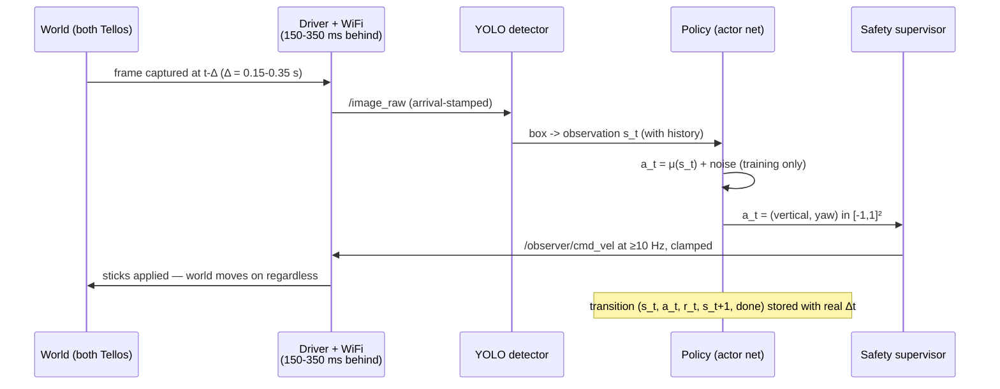

# RL Foundations — How the Learning Actually Works, From the Ground Up

**What this file is.** The deep explanation behind [rl_specification.md](rl_specification.md).
The specification says *what* to build; this document explains *why every piece exists*, starting
from the basics of reinforcement learning and cashing out every abstract idea against this
project's verified numbers — the 960×720 frame, fx = 919.42 px, the 150–350 ms link latency, the
0.35 s dead-man, the paper's own reward and hyperparameters. Nothing here changes the
specification; where a design choice is restated, the spec section that owns it is cited.

Tags as everywhere in this set: **[P]** from the paper · **[V]** verified in this repo or by
computation (every number in this file was recomputed in a script before being written down) ·
**[D]** a design decision.

---

## 1. The task, stated without any RL words

One Tello looks at another Tello through its camera. A detector turns each frame into a bounding
box. From that box we know two things: *where* the target sits in the image (the box centre), and
*roughly how far away it is* (the box size, because the target's true width is known). The job is
to move four stick axes — forward/back, up/down, yaw, (lateral unused) — so that the box stays
centred and the distance stays in a band.

Split the job as the paper does **[P §2.1.2]**:

- **Depth** (forward/back) is handled by a hand-coded rule — in our version the metric standoff
  `d = fx·W/w` (see the [reference analysis §6.4](drl_ros2_reference_analysis.md), which replaced
  the paper's unsafe ratio thresholds).
- **Centring** (vertical + yaw) is what the learned policy does.

Be honest about the alternative before adding any learning: a proportional controller —
`yaw_rate = -k · horizontal_error`, `climb = -k · vertical_error` — solves the *static* version
of this problem in two lines. That P-controller is our null baseline
([rl_specification.md §10](rl_specification.md)). What it cannot do, and what learning is being
asked to buy, is behaviour under the two hard properties of this system:

1. **Delay.** The image the controller reacts to is 150–350 ms old **[V]**. A P-controller with
   a delayed error signal oscillates once the gain is high enough to track briskly; tuning it
   down makes it sluggish. A policy that carries history can, in principle, *lead* the target —
   act on where the target will be, not where it was.
2. **Motion.** A crossing target at 1 m/s seen from 2 m sweeps **~46 px per 100 ms control
   step** [V, recomputed from fx]. The error signal moves fast relative to the control rate, so
   reacting to the current error alone is always a step behind.

If the trained policy does not beat the P-controller under delay and motion, the learning earned
nothing — which is exactly why the evaluation keeps that baseline arm.

---

## 2. Where the "agent" ends and the "environment" begins

RL's first formal move is drawing a boundary. Everything inside the boundary is the **agent**:
here, that is *only the policy function* — a small neural network mapping an observation vector
to two numbers in [−1, 1]. Everything else is the **environment**:

- the follower's own flight dynamics and the Tello firmware's stick response,
- the Wi-Fi link, the H.264 encode/decode, and their 150–350 ms of latency **[V]**,
- **the YOLO detector** — its jitter, its misses, its weaker performance on small targets
  **[P Appendix A]**,
- the target Tello's behaviour,
- the safety supervisor's clamps.

This boundary has a consequence people miss: **detector noise is environment dynamics.** When the
box jitters by 5 px or vanishes for three frames, that is, formally, the environment being
stochastic. The policy cannot be trained in a world without those effects and then be expected to
handle them — which is why the training environment specification
([rl_specification.md §9](rl_specification.md)) injects measured latency, box jitter, and dropout.
"Simulate the environment" means simulating *everything outside the policy*, including the sensor
pipeline's failures, not just the aircraft.

---

## 3. The interaction loop — one step of our system, precisely

RL happens in discrete steps. One step at the 10 Hz control rate on our hardware:



Three facts about this loop that shape everything downstream:

- **The world never pauses.** The reference codebase freezes Gazebo around every step, making
  time stop while the network thinks ([reference analysis §4.1](drl_ros2_reference_analysis.md)).
  We do not get that. Inference must fit inside the control period, and *training happens in a
  separate process or offline* — never between steps.
- **Publishing is continuous, not per-decision.** The driver zeroes any command older than
  0.35 s **[V `node.py:1099-1114`]**. "Do nothing" is a message that must be sent, not an absence
  of messages.
- **What the policy sees is old.** At decision time the observation describes the world of
  1.5–3.5 control steps ago [V]. This single fact drives the observation design (§5).

Each step produces the tuple the whole method runs on:

```
( s_t , a_t , r_t , s_t+1 , done_t )
  what I saw · what I did · what it paid · what I saw next · did the episode end
```

Learning never needs anything else. Every algorithm below is a way of turning a pile of these
tuples into a better policy.

---

## 4. The MDP — the formalism, and where our problem breaks it

A **Markov Decision Process** is the mathematical object RL assumes: states `s`, actions `a`, a
transition law `p(s'|s,a)` (given where you are and what you do, the distribution over where you
land), and a reward function `r(s,a)`. The **Markov property** is the load-bearing assumption:

> The current state summarises everything about the past that matters for the future.
> `p(s_t+1 | s_t, a_t)` — nothing before `t` adds information.

Every convergence argument, every Bellman equation, silently uses this. So test it on our raw
observation, the centring error `(ex, ey)`:

- Two situations with the *same* error — target drifting left vs drifting right — demand
  *opposite* actions. The single-frame error cannot distinguish them. **Velocity is hidden.**
- The last 2–4 actions are still "in flight" through the latency pipe: their effects have not yet
  appeared in any image. Two identical observations, one preceded by a hard yaw command and one
  by stillness, have very different futures. **The pipeline contents are hidden.**

So the raw observation is **not** Markov — the problem is a **POMDP** (partially observed MDP)
**[D, and rl_specification.md §1]**. The paper ignores this; it is the most likely mechanical
reason its performance collapses as target motion grows (99 % → 42 % across scenarios 1→5
**[P Table 4]**).

The engineering response is standard and cheap: **augment the observation until it is
approximately Markov again.**

| Hidden quantity | What we add | Why it recovers it |
|---|---|---|
| target image-plane velocity | previous error `(ex, ey)_prev` | finite difference over one step ≈ velocity; at 46 px/step this signal is large, not subtle |
| commands still in the latency pipe | last k = 4 actions | 4 × 100 ms covers the worst measured 350 ms; the policy can *see what it already ordered* and stop re-ordering it |
| detection validity | `visible`, `staleness` | a missing box is a different situation from a centred box, and must look different |

This is the same trick as frame-stacking in the Atari DQN work — there, four frames recover
ball velocity; here, one previous error and four actions recover target velocity and pipe
contents. If the control rate is raised to 20 Hz, the same latency is 3–7 steps [V], so the
history length must scale with the rate — the two parameters are coupled and must be recorded
together.

**Model-free**, while we are defining terms: we will never write `p(s'|s,a)` down. The physics,
the Wi-Fi, the detector — all of it is sampled by *acting*, not modelled by equations. The
simulator exists to make that sampling cheap and safe, not to give the agent a model.

---

## 5. Return and discount — what γ = 0.99 actually does

The agent does not maximise the next reward; it maximises the **return** — the discounted sum of
everything that follows:

```
G_t = r_t + γ·r_t+1 + γ²·r_t+2 + ...        γ ∈ [0,1)
```

Three readings of γ, all true at once:

1. **A horizon knob.** Rewards ~`1/(1−γ)` steps ahead still carry weight; beyond, they fade.
   γ = 0.99 → horizon ≈ **100 steps = 10 s at 10 Hz** [V]. That is the right scale for a chase
   segment: long enough that "let the target drift now, pay for it in three seconds" is visible
   to the learner.
2. **The thing that keeps values finite.** An endless chase with bounded rewards sums to a
   bounded return only because γ < 1.
3. **A soft episode end.** γ is equivalent to a `1−γ` probability per step that the task ends —
   a useful reading when episodes have no natural terminal.

Now the paper's own numbers **[P Table 2]**: γ = 0.99 with a **10-step episode**. Over 10 steps
the deepest discount applied is γ¹⁰ = **0.904** [V] — the last step still counts at 90 %. The
discount is nearly inert; the "long-horizon" machinery is switched on but has nothing to reach.
That is inconsistency #9, and it is why the specification lengthens episodes to 200–500 steps
([rl_specification.md §8](rl_specification.md)): with γ = 0.99, an episode shorter than the
discount horizon wastes the algorithm's defining capability.

---

## 6. Value functions and the Bellman equation — the heart of the method

**The action-value function** is the single most important object:

```
Qπ(s, a) = expected return if I take action a in situation s, and follow policy π afterwards
```

In our terms: *"the target is 200 px left and drifting; if I yaw left at 40 % stick now and then
behave as I usually do — how well does the rest of this chase go?"* One number answers it.

Why Q and not just "which states are good" (that is V(s))? Because **acting requires comparing
actions**, and Q is exactly the object indexed by action. Given a perfect Q, the best policy is
trivially "pick the a that maximises it" — no planning, no model, no lookahead. All the hard
work has been pushed into learning one function.

### The Bellman equation — self-consistency instead of supervision

We have no labels for Q — nobody tells us the true expected return. What we have is a
consistency condition. Peel the first reward off the return:

```
G_t = r_t + γ·G_t+1
⇒  Qπ(s,a) = E[ r + γ·Qπ(s', π(s')) ]           (Bellman expectation equation)
⇒  Q*(s,a) = E[ r + γ·max_a' Q*(s', a') ]       (Bellman optimality equation)
```

Read it as a promise: *the value of now must equal the reward you actually collected plus the
discounted value of where you actually landed.* Any function that violates this is wrong
somewhere, and the violation is measurable from a single transition tuple:

```
δ = ( r + γ·Q(s', a') ) − Q(s, a)               the temporal-difference (TD) error
      └── the "target" y ──┘
```

δ is **surprise**. Positive: things went better than the current Q predicted; nudge Q(s,a) up.
Learning is the process of shrinking surprise across all visited transitions — regression of
Q(s,a) toward targets the function itself helps produce. That self-reference is called
**bootstrapping** — learning a guess from a guess — and it is both the method's power (no waiting
for episode ends, every step teaches) and the source of every instability in §8.

### A worked update, with our reward's real magnitudes [V]

Take the paper's reward (§7 below): at `dist = 200 px`, `r = −50`. Suppose the current critic
says `Q(s,a) = −800`, the policy acts, the target moves to 150 px, and the critic rates the next
situation `Q(s',a') = −700`:

```
y = −50 + 0.99·(−700) = −743
δ = −743 − (−800)      = +57      → this action was better than believed; raise Q(s,a)
```

And the magnitudes matter. If the error sat at 200 px *forever*, the return would be
`−50/(1−0.99) = −5,000`; perfect centring forever is `+100/(1−0.99) = +10,000` [V]. A small MLP
is being asked to regress targets spanning ±10⁴ — which is precisely why the specification
normalises pixels by 480/360/600 and why reward scale is a design decision, not a detail
([rl_specification.md §2](rl_specification.md)).

---

## 7. The reward — the only channel that says what we want

The reward function *is* the task definition. The policy will optimise what is written, not what
was meant, with the single-mindedness of an optimiser. So read the paper's reward geometrically
**[P §2.2.3]**:

```
r = 100 − dist         if dist < 110       a steep bowl: +100 at perfect centring, falling 1/px
r = −0.25·dist         if dist > 110       a gentle far-field slope: −27.5 at 111 px, −150 at the corner
```

The intent is sound: strong gradient where precision matters, mild but nonzero gradient far away
so there is always a direction worth moving (a **dense** reward — every step teaches, which is
why a modest algorithm like DDPG has a chance here at all; with reward only at "success" the
agent would flail for a very long time before its first signal).

But the two branches do not meet. Approaching the threshold from inside: −10. From outside:
−27.5. A **17.5-point cliff** [V, recomputed] at exactly the boundary the agent orbits during
normal operation. Why that is worse than it looks: the critic must represent Q, and Q inherits
every kink in r *smeared through the dynamics*. A discontinuity at the operating boundary means
neighbouring, nearly identical states carry systematically different targets — persistent TD
error the network can reduce but never resolve, noise injected into the actor's gradient
precisely where fine control is needed. The fix costs one line — anchor the outer branch at the
same value (`r = −10 − 0.25·(dist−110)`) — and the spec keeps both versions as an ablation,
because "what did the discontinuity cost" is itself a publishable measurement
([rl_specification.md §6](rl_specification.md)).

> **UPDATE (2026-09-11).** The paper's *published code* uses threshold **100, not 110**
> (`reward -= dist*0.25 if dist > 100 else -(100 - dist)`): defined everywhere, cliff **25**
> points (0 inside vs −25 outside). Everything said above about the cliff's effect on the critic
> holds — slightly amplified. Both variants and the code-anchored repair:
> [rl_block_diagram.md §5](rl_block_diagram.md#5-the-reward-function-exactly).

Two added terms, and the failure each one buys off **[D]**:

- **Loss penalty** (terminal, on the box leaving the frame): the evaluation metric *is* time in
  view **[P §3]**; without an explicit penalty, "target drifts out while reward stays mild" is
  not clearly bad to the learner. Also: define what the reward *is* when there is no box (our
  answer: the episode ends there, with the penalty). An undefined case in the reward is a bug
  farm.
- **Smoothness penalty** `‖a_t − a_t−1‖²`: without it, jittering the sticks is free. The Tello's
  sticks saturate fast, jitter excites the airframe, and — subtler — under 150–350 ms of latency
  an oscillating action sequence and a smooth one can produce nearly identical *observed* errors
  for several steps, so nothing else in the loop discourages jitter. The paper considered exactly
  this term and dropped it for training-complexity reasons **[P §2.2.3]**; a small weight, or a
  rate limit on the output, recovers most of it.

**Reward hacking**, concretely, in this system: any behaviour that scores well while defeating
the purpose. Watch for: hovering at the reward bowl's edge collecting mild negatives instead of
chasing (bowl too shallow far out); "centring" by yawing wildly so the box crosses the centre
often (fixed by the smoothness term); and — before the depth rule was repaired — charging the
target because closing distance grows the box and shrinks pixel error per metre of true error
(the 0.47 m finding, [reference analysis §6.3](drl_ros2_reference_analysis.md)). The defence is
never cleverness, it is *watching flights and asking what the number actually rewarded*.

---

## 8. From values to actions — why continuous control needs an actor

With a discrete action set, the policy is free: compute Q for each action, take the argmax. Our
actions are two **continuous** sticks — `argmax_a Q(s,a)` over a continuum is itself an
optimisation problem, and running one inside every 100 ms control step is a non-starter.

**DDPG's move** (Deep *Deterministic* Policy Gradient): learn the argmax. A second network, the
**actor** `μ(s) → a`, is trained so its output climbs the critic's landscape:

```
∇θ J  =  E[ ∇a Q(s,a)|a=μ(s) · ∇θ μ(s) ]        (deterministic policy gradient)
```

In words: the critic, being differentiable, can say not just "this action scores −743" but
*"a little more up-stick would have scored higher"* — a slope in action space. Backpropagation
carries that slope through the actor's weights. The actor is a learned, amortised argmax: all the
optimisation happens at training time, and at flight time choosing an action is one forward pass
of a two-layer MLP — microseconds, comfortably inside the budget.

Two implementation notes that stop being trivia once you know why:

- The actor's `tanh` output lands in [−1, 1] — which **is** the driver's `/cmd_vel` contract
  **[V `node.py:1084-1092`]**. No rescaling layer exists between the network and the aircraft,
  and none should be added ([rl_specification.md §4](rl_specification.md)).
- The critic takes the action as an *input* (`Q(s,a)`, action injected at the first hidden
  layer) — it must be differentiable *with respect to the action*, which is the whole mechanism
  above. This is why the critic is a network over `(s,a)` pairs, not a per-action output head.

---

## 9. Why the naive version diverges — and the machinery that holds it up

Take §6 and §8 literally — one critic, one actor, learn from the last transition — and training
diverges. Not "converges slowly": diverges, notoriously. Each piece of DDPG's machinery answers
one specific failure. This is the section to internalise before touching hyperparameters,
because every knob belongs to one of these four stories.

### 9.1 Correlated data → the replay buffer

Consecutive transitions from a flight are nearly identical — same neighbourhood of state space,
same recent policy. Gradient descent on a stream of near-duplicates is regression on one
mislabelled point at a time: the network overfits the current corner of the world and forgets
the rest ("catastrophic forgetting" is not a metaphor; the Q surface elsewhere genuinely
deforms). The **replay buffer** (spec: 10⁵ transitions) stores tuples and trains on *random*
minibatches (spec: 64), which:

- breaks temporal correlation — a batch mixes situations from many flights and phases,
- **reuses experience** — each real transition trains many updates. In simulation this is
  economy; on hardware it is the difference between needing hours and needing weeks of flight,
  because every real sample costs battery and crash risk,
- makes the method **off-policy**: the buffer holds actions taken by *older* policies (and by
  the exploration noise). The Bellman target tolerates this because it asks "what would the
  *current* target policy do at s′" — `μ′(s′)` — not "what did we happen to do next".

Off-policy-ness is also a door: transitions from the **hand-coded controller** are just more
off-policy data. That is the entire theory behind the demonstration-bootstrap pattern adopted
from the reference codebase ([reference analysis §3.1](drl_ros2_reference_analysis.md)) — record
the P-controller/depth-rule flights, pre-fill the buffer, pretrain before the first learned
flight, and recompute rewards on load so the reward function can be revised without re-flying.

### 9.2 The moving target → target networks

Look at the regression again: `y = r + γ·Q(s′,a′)`. The label **contains the network being
trained**. Every gradient step moves the target of the next gradient step — a dog chasing its
own tail, and the standard driver of oscillation and blow-up in early deep RL.

The fix: keep frozen-ish copies — target networks `Q′` and `μ′` — and compute labels only with
them, easing them toward the live networks by **Polyak averaging**:

```
θ′ ← τ·θ + (1−τ)·θ′        every gradient step, τ = 0.005
```

τ = 0.005 means the label-producing network moves 0.5 % per update — time constant ≈ **200
updates** [V]. The labels become slowly-moving, almost-stationary regression targets; the live
critic can actually converge toward them between shifts.

This is also why the reference codebase's cadence defect matters
([reference analysis §2.2](drl_ros2_reference_analysis.md), confirmed by running it): its `step`
counter increments per training *call*, not per gradient step, so the target network receives
**500 back-to-back updates — a 91.8 % jump [V] — every other call, and nothing in between**. The
τ = 0.005 in its config is a fiction; the mechanism §9.2 exists to provide has been silently
disabled. Our implementation counts gradient steps.

### 9.3 A deterministic policy never explores → injected noise

`μ(s)` is deterministic: same observation, same action, forever. It can never discover that a
different action scores better — the buffer fills with one behaviour's consequences. So during
training (never deployment), noise is added to the executed action:

```
a = clip( μ(s) + ε ,  −1, 1 )        ε ~ N(0, σ),  σ = 0.3 [P Table 2], decayed over training
```

σ = 0.3 on a [−1,1] range is a *large* kick — 30 % of half-range, and roughly a third of steps
get perturbed by more than 0.3 [V]. Early on that is the point (cover the space); late in
training it is why evaluation must run with **noise off** — the reference codebase's
`get_action(state, add_noise=False)` split, worth copying. Original DDPG used
Ornstein–Uhlenbeck (temporally correlated) noise; later practice found plain Gaussian equivalent
— the paper gives σ but not the process, and the spec chooses Gaussian
([rl_specification.md §8](rl_specification.md)).

> **UPDATE (2026-09-11).** The process is no longer unknown: the paper's published code uses
> **Ornstein–Uhlenbeck(θ=0.15, μ=0, σ=0.3)** via keras-rl, applied only while `training=True` —
> so deployment is provably noise-free (`rl_drone.py:55`;
> [rl_block_diagram.md §3](rl_block_diagram.md#3-block-diagram--training)). The faithful arm
> reproduces OU; Gaussian stays the improved-arm choice. Note also the code's action range is
> ±60 (tanh × 60), not [−1, 1] — the clip shown above describes our normalised convention.

On hardware, exploration noise passes through the safety supervisor like every other command
**[D]** — geofence, speed cap, dead-man are outside the agent boundary (§2) and clamp noisy
actions exactly as they clamp deliberate ones. Exploration is also, overwhelmingly, a
*simulation* activity: the real aircraft mostly flies the matured policy.

### 9.4 max-bias → why DDPG is brittle, and what TD3 adds

The optimality target takes a maximum (through the actor: `Q′(s′, μ′(s′))`, and the actor is
trained to climb Q — an implicit max). Maxima are biased upward under noise. Not subtly:
take **two unbiased** estimates of a value whose truth is 0, each ±1 of noise —
`E[max] = +0.564` [V, simulated and matching theory 1/√π]. A max over estimates *manufactures*
optimism out of pure noise, the optimism feeds the next target, and the critic inflates —
"overestimation", DDPG's signature failure. In curves it shows as `avg_Q` climbing far above the
returns actually being achieved.

**TD3** is three surgical fixes on this exact wound, which is why the plan structures it as a
flag on the DDPG skeleton ([reference analysis §5](drl_ros2_reference_analysis.md)):

1. **Twin critics, min target**: `y = r + γ·min(Q′₁, Q′₂)`. The min of two noisy estimates is
   pessimistic by the same amount the max was optimistic [V] — bias flipped to the safe side.
2. **Target-policy smoothing**: add clipped noise to `μ′(s′)` inside the target, so a narrow
   spurious spike in Q cannot be exploited as a label.
3. **Delayed policy updates**: update the actor every 2nd critic step, so the actor climbs a
   surface that has had time to settle.

Plan of record: **DDPG first** — faithful to the paper, reproducible — then TD3 as a
configuration flag, and the critic architecture copied from the reference repo's clean SAC
critic, never its TD3 critic (8 of its 16 parameters are detached from the graph — verified by
test, [reference analysis §2.1](drl_ros2_reference_analysis.md)).

---

## 10. The whole algorithm, assembled and annotated

Everything above, as the loop we will actually run (sim first; on hardware the *collect* half
runs live and the *update* half runs in a separate process):

```
initialise actor μθ, critic Qφ, targets μ′ ← μθ, Q′ ← Qφ
pre-fill buffer from hand-coded-controller flights; recompute rewards; pretrain   (§9.1)

for each environment step:                                # 10 Hz, world never pauses (§3)
    s  = observation with history                          # Markov repair (§4)
    a  = clip(μθ(s) + N(0,σ), −1, 1)                       # exploration (§9.3)
    execute a through the safety supervisor                # clamps apply to noise too
    observe r, s′, done; store (s, a, r, s′, done, Δt)     # real Δt recorded (§3)

for each gradient step (decoupled from environment steps):
    sample minibatch of 64 from buffer                     # decorrelation (§9.1)
    y  = r + γ·(1 − done)·Q′(s′, μ′(s′))                   # Bellman target, frozen nets (§6, §9.2)
    φ  ← φ − α·∇φ mean( (Qφ(s,a) − y)² )                   # critic: regression on y
    θ  ← θ + α·∇θ mean( Qφ(s, μθ(s)) )                     # actor: climb the critic (§8)
    soft-update targets, τ = 0.005                         # per GRADIENT step (§9.2)
```

One line deserves its own paragraph: **`(1 − done)`**. When a transition is terminal, the future
is truncated — the target is just `r`. But "terminal" must mean *the task ended* (target lost →
loss penalty; geofence/safety abort), **not** *the step budget ran out*. A timeout is an
accounting boundary, not a fact about the world: the chase was still worth its future value when
the clock expired. Storing timeouts with `done = 1` teaches the critic that chases die at an
arbitrary wall — a classic silent bug that biases every value downward. Rule: **bootstrap at
timeouts (`done = 0`), truncate only at genuine task-ending events.** (The reference codebase
gets this right, seemingly by accident — its `terminal` flag comes from collision/goal only, and
the step-budget reset is handled outside the stored flag.)

---

## 11. Training regime — how the theory dictates the plan

Each item in [implementation_plan.md](implementation_plan.md) is a consequence of a section
above, not a preference:

| Plan item | Which section forces it |
|---|---|
| Timing-faithful simulator with **measured** latency injected | §2 — latency is environment dynamics; a policy trained without it meets a different MDP in the air |
| Domain randomisation (latency draw, box jitter, dropout, lag constant) | §2, §4 — train against a *distribution* of environments so the real one is a sample from it, not an outlier |
| Demonstration pre-fill + pretraining from the hand-coded controller | §9.1 — off-policy learning consumes anyone's data; real flight samples are expensive |
| Episodes of 200–500 steps | §5 — γ = 0.99 needs room; a 10-step episode disables the discount |
| Curriculum: hover → slow → manoeuvring target | §7 — dense reward still gives thin signal when the target is fast from the first episode; success-gated difficulty keeps δ informative |
| Evaluation: noise off, fixed scenarios, P-controller arm | §9.3, §1 — measure the policy, not the noise; and the baseline defines what learning bought |
| ≥ 5–10 seeds with spread reported | §9.4 — DDPG's failure modes are run-to-run; single-seed numbers are anecdotes (the other doc set's Henderson protocol, doubly binding here) |
| Target speed capped below follower's | kinematics, not RL — equal airframes ([reference analysis §6.1](drl_ros2_reference_analysis.md)); otherwise scenario 5 measures a foregone conclusion |

---

## 12. Diagnostics — reading the training, and the flights

What to log, and what each signal means. (The reference repo's habit of logging `avg_Q` and
`max_Q` to TensorBoard is worth copying; the interpretations below are why.)

| Signal | Healthy | Sick — and the diagnosis |
|---|---|---|
| **Episodic return** (eval, noise off) | rising, then flat | the only signal that *is* the objective; everything else is instrumentation |
| **avg_Q vs realised returns** | tracking each other | Q racing above realised returns = overestimation (§9.4) → TD3 flag, or lower α |
| **max_Q** | bounded | secular growth = divergence beginning; catch it here, hours before the return curve shows it |
| **Critic loss** | modest, non-zero | near-zero can mean a collapsed critic; **it is not a success metric** — the regression target moves (§9.2), so a healthy run holds steady loss while everything improves |
| **Action histogram** | using the range | piled at ±1 = saturated actor: tanh gradient ≈ 0 there, learning stalls; usually reward scale or α too hot |
| **TD-error δ distribution** | shrinking spread | heavy tails that persist = a discontinuity or mislabelled terminals (§7, §10) |
| **In flight: oscillation** about the centre | — | latency unhandled — history features missing/wrong length for the control rate (§4) |
| **In flight: confident approach too close** | — | depth rule mis-calibrated — re-check §6.3 of the reference analysis before blaming the policy |
| **In flight: drifts, never commits** | — | smoothness/loss weights overpowering the centring gradient (§7) |

The debugging order that respects the dependency chain: **environment first** (replay a real
flight's boxes through the sim and compare — an unvalidated simulator invalidates everything
downstream), then reward (print it along a hand-flown trajectory; does the number rank behaviours
the way you would?), then the done-flag handling (§10), and only then hyperparameters. Most "RL
doesn't work" is one of the first three.

---

## 13. Where each idea comes from (five readings, in dependency order)

| Idea | Source |
|---|---|
| MDPs, returns, Bellman equations, TD learning | Sutton & Barto, *Reinforcement Learning: An Introduction*, 2nd ed. — ch. 3 (MDPs), 6 (TD) |
| Replay buffer + target networks for deep value learning | Mnih et al., *Human-level control through deep RL* (DQN), Nature 2015 |
| Deterministic policy gradient (the actor as learned argmax) | Silver et al., *Deterministic Policy Gradient Algorithms*, ICML 2014 |
| DDPG as implemented here | Lillicrap et al., *Continuous control with deep RL*, ICLR 2016 |
| Overestimation and the three fixes | Fujimoto et al., *Addressing Function Approximation Error* (TD3), ICML 2018 |

The paper this project reproduces **[P]** sits on top of all five; its §2.2.1 equations (1)–(2)
are the tabular background from the first row and are *not* what gets implemented
([rl_specification.md §7](rl_specification.md)).
