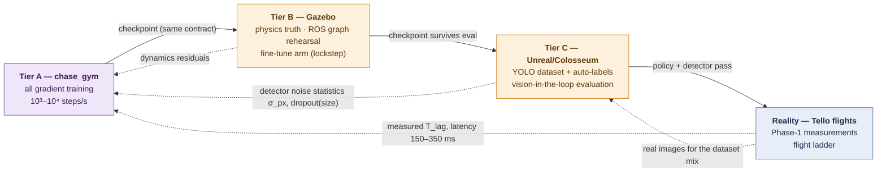

# Simulator Training Architecture — Gazebo + Unreal for the Chase/Intercept Task

**What this file is.** The complete, implementation-level architecture for training the chase
policy in simulation, given that this project has **Unreal Engine** and **Gazebo** available and
the target task is: *the Tello detects the target drone and intercepts it*. It extends
[implementation_plan.md Phase 2](implementation_plan.md) and instantiates
[rl_training_guide.md Part III](rl_training_guide.md); nothing here changes the algorithm
(TD3 trainer, three arms) — it specifies the worlds the algorithm trains and is tested in,
component by component.

**Evidence tags**: [P] chase paper · [C] its published code · [V] verified in this repo /
recomputed for this doc (2026-09-15) · [D] design decision · **[S1]–[S5] simulator-ecosystem
facts verified by web search on 2026-09-15**:

| Tag | Fact verified | Source |
|---|---|---|
| [S1] | Modern Gazebo (gz-sim) releases: **Harmonic** v8 LTS (2023→2029), **Ionic** v9 (2024→2026), **Jetty** v10 LTS (2025→2031); all on Ubuntu 24.04. Classic Gazebo 11 is not the target | gazebosim.org/docs releases |
| [S2] | `MulticopterVelocityControl` system: subscribes to **Twist** commands (default topic `cmd_vel`), computes rotor velocities; requires `MulticopterMotorModel` per rotor (motorConstant, momentConstant, timeConstantUp/Down, maxRotVelocity…); example world `quadcopter.sdf` ships with gz-sim | gz-sim source + API docs |
| [S3] | Pause/step control via the `/world/<name>/control` service with `gz.msgs.WorldControl` (pause + multi-step) — the standard lockstep mechanism; community Gym wrappers step the clock synchronously this way | gazebosim.org API "Pause and Run simulation"; gz-sim RL discussion |
| [S4] | **AirSim is archived** (Microsoft, announced 2022). Active successors: **Colosseum** (CodexLabsLLC fork, UE5, community-maintained, issues active into 2026) and **Project AirSim** (IAMAI Simulations, ex-Microsoft team, UE5) | github/microsoft/AirSim, CodexLabsLLC/Colosseum, iamaisim/ProjectAirSim |
| [S5] | Known gz-sim quadrotor issue: **positive-yaw rotation direction reported inverted** in the multicopter control path (issue #2657) — sign conventions must be tested, never assumed | gazebosim/gz-sim issue tracker |

Numbers recomputed for this doc [V]: H-FOV from our calibration = **55.1°** (matches the
doc-set's verified value), V-FOV 42.8°; oracle box widths (body 0.098 m / prop-span 0.18 m):
180/331 px @0.5 m · 90/165 px @1 m · 45/83 px @2 m · 30/55 px @3 m; **100 physics steps of 1 ms
per 0.1 s control period**; measured latency = 1.5–3.5 control periods.

---

## 0. The executive decision: three tiers, one contract

A naive plan trains the policy inside Unreal with YOLO in the loop. That plan fails on
arithmetic: rendering + detection bound the loop near real time, so the ~2×10⁵ env-steps budget
per arm per seed ([rl_training_guide.md §20](rl_training_guide.md)) becomes days-to-weeks per
run — before seeds and arms. The professional structure is **three tiers with one shared
contract**, where gradients happen where stepping is cheap, and fidelity is spent where it
buys information:

| Tier | World | Steps/sec (order) | Role |
|---|---|---|---|
| **A** | `chase_gym` — point-kinematics image-plane (pure Python) | 10³–10⁴ | **The gradient mill.** All RL training (arms F/R/T, ≥5 seeds). Already fully specified in [rl_training_guide.md §16](rl_training_guide.md) |
| **B** | **Gazebo** (gz-sim Harmonic/Jetty [S1]) — rigid-body physics, two quadrotors, lockstep | 10¹–10² (headless, no camera) | **Dynamics truth + ROS rehearsal.** Validates Tier A's lag model, hosts a fine-tune arm, runs the *unchanged* deployment node graph against sim topics, rehearses safety logic |
| **C** | **Unreal** (Colosseum [S4]) — photoreal rendering | ~real-time with vision | **Perception truth.** Generates the YOLO training set with auto-labels + domain randomisation; runs closed-loop *vision-in-the-loop evaluation* (real YOLO on rendered frames); measures the detector-noise statistics that Tier A injects |

**The one contract** that makes the tiers interchangeable [D]: every tier speaks the deployment
interfaces — a `DroneDetection` message (box centre, size, confidence, `t_capture`), the
`/cmd_vel` Twist with normalised sticks in [−1,1], the same observation-assembly module, the
same reward module, the same checkpoint format. A policy trained in A runs in B and C **without
one line changing**, because everything it touches is interface-identical.

The calibration loop closes backwards: C measures detector noise → into A's noise model; B (and
the real Phase-1 flights) measure the velocity-lag constant → into A's dynamics; A trains; B
and C evaluate; then the real flight ladder.



---

## 1. The task extension: FOLLOW → INTERCEPT

The doc set's task so far is *follow* (keep in view at a standoff). "Intercept" is a deliberate
task change, specified here so it is a config, not a fork [D]:

| Element | FOLLOW (current) | INTERCEPT (new variant) |
|---|---|---|
| Success terminal | none (survive the episode) | `range ≤ r_cap` **and** target in FOV → terminal, bonus +B |
| Forward axis | hand-coded metric standoff `d = fx·W/w` | hand-coded **closing law**: bounded closing speed scheduled by range (fast far, slow near), same axis-ownership rule — the learned policy still owns only centring |
| Reward | §16.2 of the guide | same centring core **+ potential-based range shaping**: `F = γ·Φ(s′) − Φ(s)` with `Φ(s) = −λ·range` — provably policy-invariant by Ng et al. 1999 ([rl_training_guide.md §22](rl_training_guide.md)), so the closing incentive cannot corrupt the optimum, plus the terminal capture bonus |
| Null baseline | P-controller | **proportional navigation (PN)** — the classical interception law (lateral acceleration ∝ line-of-sight rate × closing speed). If the learned policy does not beat PN under latency, ship PN. Same honesty rule as before |
| Kinematics guard | target speed cap (equal airframes) | same — both are Tellos; an uncatchable target measures nothing [drl_ros2_reference_analysis.md §6.1](drl_ros2_reference_analysis.md) |

Parameters [D, to record with results]: `r_cap = 0.5 m` (body box ≈ 180 px wide there [V] —
detection still healthy; going closer both saturates the box and removes reaction margin),
`B = +10` (scaled units; must dominate any continuation value), `λ` small (0.1) — shaping
guides, the capture bonus decides. A 3-DoF learned arm (policy also owns closing speed) is a
documented ablation, not the default — axis ownership stays exclusive.

---

## 2. Tier A — `chase_gym` (recap of its role)

Fully specified in [rl_training_guide.md §16](rl_training_guide.md); unchanged here except two
additions for INTERCEPT: the range state drives the closing law + shaping term, and reset draws
initial range from an approach band (2–6 m; box 45–15 px body [V] — which is exactly why the
detector's small-target behaviour matters, §5). Tier A remains **the only place gradients run
at scale**. Its noise and lag models are *measured*, by Tiers B/C and reality — that is what
makes its speed legitimate rather than wishful.

---

## 3. Tier B — Gazebo, component by component

Target version: **Harmonic (v8 LTS) or Jetty (v10 LTS)** [S1] with ROS 2 via `ros_gz`. Classic
Gazebo 11 is end-of-life — not used. Platform note [V]: this machine is WSL2; run the server
headless (`gz sim -s`) for training — no rendering needed in Tier B's main mode — and treat GUI
rendering as optional.

### 3.1 World and models

One SDF world, two quadrotor models (`follower`, `target`), ground plane, no other geometry in
the training world (a hall-sized box for the eval world).

**Tello model parameterisation** — stated honestly, because exact Tello aero/motor constants
are not public:

| Parameter | Value | Status |
|---|---|---|
| Mass | 0.080 kg | [V manufacturer, already verified in this doc set] |
| Body extent | 0.098 m width × 0.041 m height (depth ≈ width; refine from the spec page during model build) | [V width/height; depth to confirm] |
| Prop-span extent | 0.18 m | [V assumption recorded in doc set] |
| Inertia | rectangular-box estimate `Ixx = m/12·(h²+d²)` etc. | [D estimate → refined by matching flight data] |
| Rotor plugin constants (`motorConstant`, `momentConstant`, `timeConstantUp/Down`, `maxRotVelocity`) [S2] | **calibrated, not guessed** — see §3.2 procedure | [D] |

### 3.2 The stick interface — making Gazebo speak Tello

The load-bearing verified fact [S2]: gz-sim ships `MulticopterVelocityControl`, which
subscribes to a **Twist** command (default topic literally `cmd_vel`) and, with
`MulticopterMotorModel` on each rotor, flies the vehicle at commanded linear velocity + yaw
rate. That is *semantically the Tello stick contract already*. The emulation layer is one thin
node:

```
tello_sim_shim (per vehicle):
  in:  /<ns>/cmd_vel            geometry_msgs/Twist, sticks in [-1,1]   ← SAME as real driver
  map: linear.x,y,z → v_cmd = stick · v_max   (v_max param, default 1.5 m/s [D safety])
       angular.z    → yaw_rate = stick · ω_max (ω_max param)
  out: gz topic consumed by MulticopterVelocityControl (via ros_gz bridge)
  extras: dead-man — zero the command if input stale > 0.35 s  ← replicates the real driver [V]
```

Everything above the shim — `chase_state`, `chase_policy`, `chase_mixer`, `chase_safety`, the
behaviour manager — runs **unchanged** against the sim. That is the entire point of Tier B's
ROS-rehearsal role.

**Calibration procedure** [D] (order matters):
1. Set mass/inertia; pick `motorConstant` so hover sits near mid-throttle.
2. Command velocity steps on each axis; tune motor time constants + velocity-controller gains
   until the sim's step response matches the **measured** Phase-1 `T_lag` within ~10 %.
3. Randomise the residual: ±30 % on `T_lag`-equivalent per episode, as in Tier A [D].
4. **Sign test before anything else** [S5]: gz-sim has a reported inverted-positive-yaw issue
   (#2657). Protocol: command `+yaw` for 1 s, assert the target's image moves the expected
   direction through the *whole* chain (shim → plugin → oracle → observation). The original
   chase code needed a `−yaw` sign flip on real hardware [C `main.py:225`]; assume nothing —
   test the convention end-to-end in every tier, once, and record it in the checkpoint's action
   map.

### 3.3 Ground truth → synthetic detection (the oracle)

Tier B's main mode needs **no rendering at all**. Poses come from the sim (odometry publisher /
pose topics via `ros_gz` bridge), and a small node replaces the detector:

```
sim_oracle_detector:
  in:  follower pose, target pose (sim truth)
  do:  1. transform target into the follower CAMERA frame
          (camera extrinsics = the Tello's fixed forward camera mount)
       2. project with OUR REAL CALIBRATION  fx = fy = 919.42 px, c = (480, 360)  [V ost.txt]
          — never the sim camera's default intrinsics: the policy must live in the
          real camera's geometry
       3. box centre = projected centroid; box size from W = 0.098 m (or 0.18 m variant),
          H = 0.041 m  → w_px = fx·W/range, h_px = fy·H/range
       4. FOV test (55.1° × 42.8° [V]): outside → no detection published
       5. corruption per Phase-0 statistics: centre jitter ~N(0, σ_px), dropout
          probability rising as w_px shrinks (the paper's own detector weakness [P App. A])
  out: /chase/detection  (DroneDetection: box, confidence, t_capture)  ← IDENTICAL msg
       to the real chase_detector's output
```

Then the standard `latency_shim` delays these messages by Δ drawn from the **measured
150–350 ms** distribution [V] — implemented as a sim-time queue so it works in lockstep. An
optional camera mode (gz camera sensor, 960×720, bridged as `sensor_msgs/Image`, real YOLO
node) exists for integration tests only — it is Tier C's job to do vision seriously.

### 3.4 Lockstep RL loop — `GzChaseEnv`

The Gym wrapper that lets the *same* TD3 trainer run against Gazebo:

```
class GzChaseEnv(gym.Env):
    step(a):
      1. publish a through tello_sim_shim            (and the scripted target's command)
      2. call /world/<w>/control  (gz.msgs.WorldControl): advance EXACTLY 100 physics
         steps of 1 ms  = one 0.1 s control period    [S3; 100 = Δt/1 ms, V]
      3. read poses → sim_oracle_detector → latency_shim   (all on sim time)
      4. s′ = assemble_observation(...)               ← the SAME module as Tier A and flight
      5. r  = reward(TRUE geometry)                   ← the SAME reward module
      6. terminated: capture (INTERCEPT) / target out of catchable volume; truncated: budget
    reset(): world reset + set_pose services; draw scenario, latency base, T_lag residual; seed
```

- **Determinism**: lockstep + seeded generators ⇒ reproducible episodes — exactly what
  Henderson-grade reporting needs ([rl_training_guide.md §24](rl_training_guide.md)).
- **Parallelism**: N independent headless servers, isolated by `GZ_PARTITION`, one env per
  process; the replay buffer is shared by the trainer process.
- **The pause-the-world nuance**, stated precisely so it doesn't contradict
  [drl_ros2_reference_analysis.md §4.1](drl_ros2_reference_analysis.md): pausing physics per
  step was rejected there **as a transfer/timing model** (it lets wall-clock inference time
  vanish, which reality does not allow). For *training in simulation* lockstep is the correct
  pattern, under three conditions [D]: (a) one env step = exactly the deployment control period
  (0.1 s of sim time); (b) latency is injected explicitly in the observation channel (it no
  longer arises "for free" from wall-clock); (c) deployment inference time is separately
  budgeted `< Δt` — ours is a microseconds-scale forward pass, verified trivially.
- **Throughput honesty** [D, estimate to be measured]: headless, no rendering, two small
  models ⇒ expect real-time-factor well above 1; tens of env-steps/s per instance is the
  planning figure. That funds a **fine-tune arm** (∼10⁴ steps) and full evaluations — not the
  2×10⁵-step primary training, which stays in Tier A.

### 3.5 What Tier B certifies

1. **Dynamics validation** of Tier A: run identical action logs through A and B; compare box
   trajectories (the same replay-validation gate as against real flights).
2. **ROS graph rehearsal**: the full deployment graph (state → policy → mixer → safety → shim)
   on sim topics, including dead-man behaviour, loss handling, engage gate.
3. **Fine-tune arm** (optional, reported separately): continue TD3 from the Tier-A checkpoint
   for ~10⁴ lockstep steps — measures how much rigid-body effects (attitude tilt during
   acceleration, yaw-translation coupling) change the policy; a large gap here is a red flag
   *before* any real flight.
4. **Intercept safety rehearsal**: capture-radius behaviour, closing-speed schedule, abort
   paths — crashed sims are free.

---

## 4. Tier C — Unreal via Colosseum, component by component

> **UPDATE (2026-09-16) — the default Tier-C engine changes to Project AirSim.** Colosseum was
> **archived on 2026-07-11** (repository banner, verified; its main branch targets UE 5.6).
> Project AirSim was **open-sourced 2025-05-15** (MIT; Microsoft + IAMAI announcement in
> microsoft/AirSim discussion #5024) and is actively pushed (last push read 2026-09-16). New
> default: **Project AirSim**; fallback: Colosseum pinned to a commit — tolerable only because
> Tier C's jobs are batch and replaceable (§6). The §4.x component descriptions below carry the
> AirSim-lineage API either engine exposes. Evidence and the full 2026 simulator survey:
> [offline_training_recipe.md §6.3](offline_training_recipe.md).

**Tool choice, verified** [S4]: original AirSim is archived; **Colosseum** is the maintained
open-source fork on UE5 and keeps the AirSim API surface (settings.json, Python client, image
APIs); **Project AirSim** (IAMAI) is the commercial-track alternative. Default: Colosseum [D];
its API names below are the AirSim-lineage API the fork carries.

### 4.1 Scene and camera

- Indoor-hall map approximating the real test hall (scale, lighting classes: low/medium/high —
  mirroring the paper's brightness study [P Table 5]).
- Follower = Colosseum multirotor; camera configured to match the **real** sensor:
  `Width 960, Height 720, FOV_Degrees 55.1` [V — the horizontal FOV from our calibration].
  Matching FOV matters more than matching lens model: the policy's geometry lives in (fx, c).
- Target = second vehicle, or an animated Tello-scale mesh driven along scenario splines
  (static / constant-v / vertical & horizontal oscillation / aggressive — the five families).

### 4.2 Job 1 — the YOLO dataset factory

```
dataset_factory (Python, Colosseum API):
  loop over: scene lighting × target pose grid × ranges 0.5–6 m × backgrounds × motion blur
    1. place target; step or fly-by
    2. capture RGB (960×720) + segmentation view (per-object ID)
    3. bbox = tight box around the target's segmentation mask  → YOLO label, free and exact
    4. store with metadata (range, w_px, lighting)
  output: labelled set stratified BY TARGET PIXEL SIZE  → detector accuracy-vs-size curve
```

This attacks the paper's own named weakness (small targets [P App. A]) with unlimited exact
labels, and — per [implementation_plan.md Phase 0](implementation_plan.md) — the set is
**mixed with real captured images**; synthetic-only detectors inherit the renderer's domain.
The measured accuracy/jitter/dropout-vs-size curves are exported as the corruption model file
consumed by Tier A and the Tier-B oracle: this is the concrete mechanism of the "C feeds A"
arrow.

### 4.3 Job 2 — vision-in-the-loop evaluation

The full pipeline, with nothing mocked:

```
rendered frame (960×720) → REAL YOLO → real chase_state → TRAINED policy (inference)
  → real mixer/safety → Colosseum velocity API (vx, vy, vz, yaw_rate — the stick semantics)
  → renderer moves the world → next frame
```

Run near real time (rendering-bound); score exactly the flight metrics: time-in-view %,
detection %, capture rate / time-to-capture, per scenario × lighting. This is where "the
policy tolerates *real detector noise*, not our model of it" is established — the last gate
before hardware. It is deliberately an **evaluation**, not a training ground: at ~10 Hz
effective it contributes statistics, not gradients.

### 4.4 Sign/units test, again

Same protocol as §3.2 item 4, against the Colosseum NED convention (AirSim-lineage APIs are
NED, z-down): one axis at a time, assert image-space effect, record the mapping in the
checkpoint's action map. Three simulators + one aircraft = four chances for a silent sign flip;
the original needed one on hardware [C]; budget an hour, not a debugging week.

---

## 5. What runs where — the consolidated map

| Component | Tier A | Tier B | Tier C | Reality |
|---|---|---|---|---|
| TD3 trainer (arms F/R/T, seeds) | **all gradients** | fine-tune arm only | — | — |
| Observation assembly (one module) | ✔ | ✔ | ✔ | ✔ |
| Reward module (truth-based) | ✔ | ✔ | scoring only | scoring only |
| Detector | corruption model | oracle + corruption | **real YOLO** | real YOLO |
| Latency | injected (measured dist.) | injected (sim-time shim) | intrinsic (rendering) + injected top-up to match measured | intrinsic |
| Vehicle dynamics | 1st-order lag (calibrated) | rigid-body + rotors (calibrated) | Colosseum multirotor | Tello |
| ROS 2 deployment graph | — | **full rehearsal** | partial (bridged) | full |
| Safety logic | — | rehearsed | rehearsed | live |
| Scenario generators (5 families) | ✔ | ✔ (scripted target) | ✔ (splines) | target Tello commanded |

Promotion gates [D]: A-checkpoint passes B's dynamics eval within tolerance → passes C's
vision-in-the-loop on ≥ the P-controller/PN baseline → flight ladder
([implementation_plan.md Phase 4](implementation_plan.md)). Any gate failure feeds a model
correction *backwards* (lag residual → A; noise stats → A) rather than a hyperparameter hunt.

## 6. Risks specific to this architecture

| Risk | Evidence | Mitigation |
|---|---|---|
| gz yaw/axis sign conventions | inverted-yaw report in gz-sim [S5]; the original needed a −yaw on hardware [C] | the §3.2/§4.4 sign-test protocol, per tier, recorded in the checkpoint |
| WSL2 rendering/GPU limits | this host is WSL2 [V] | Tier B headless (no rendering needed); Tier C on a native-GPU machine if the WSL2 UE5 path underperforms — dataset/eval jobs are batch, they can run elsewhere |
| Sim2sim gap A↔B | first-order lag vs rigid body | the identical-action-log comparison is a standing gate, not a one-off |
| Colosseum maintenance risk | community fork [S4] | its role is dataset+eval (batch, replaceable); Project AirSim is the fallback; nothing gradient-critical depends on it |
| Tello motor constants unknown | not public | calibrate to measured step response (§3.2), randomise the residual — never present sim dynamics as ground truth |
| Oracle optimism (perfect boxes) | oracle has no perception failures | corruption model is mandatory in A and B; C exists precisely to keep it honest |

## 7. Verification record

Tool facts [S1–S5] verified by web search 2026-09-15 (Gazebo release/LTS matrix; multicopter
plugin API and its default `cmd_vel` Twist subscription; WorldControl pause/multi-step service;
AirSim archived / Colosseum + Project AirSim active; gz yaw-sign issue). Geometry recomputed
[V]: FOV 55.1°/42.8° from fx = 919.42; oracle box-size table 0.5–6 m; 100 × 1 ms physics steps
per control period; latency = 1.5–3.5 periods. Task-extension shaping invariance rests on
Ng et al. 1999 as verified for [rl_training_guide.md §22](rl_training_guide.md). Throughput
figures in §3.4 are **estimates flagged as estimates** — measure them in week one and update
this section.
