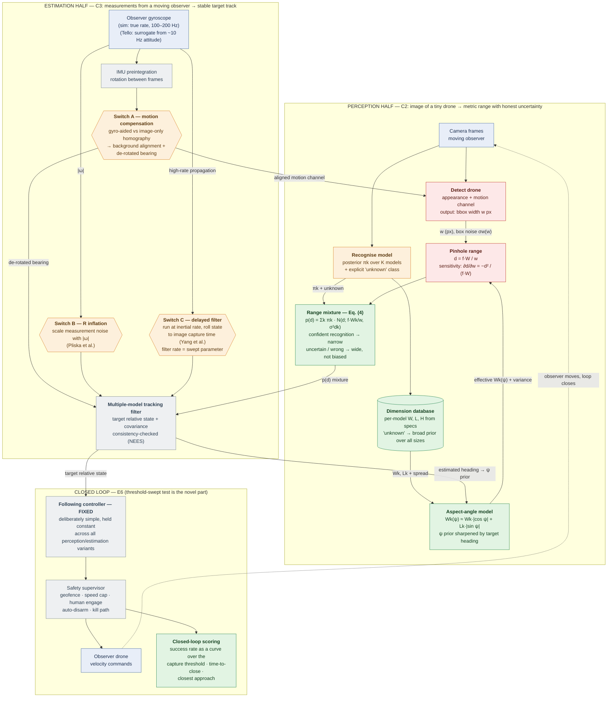
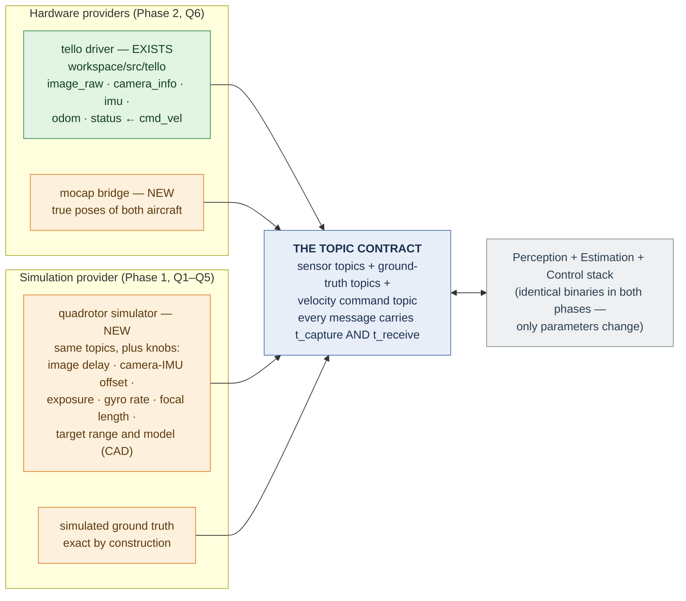
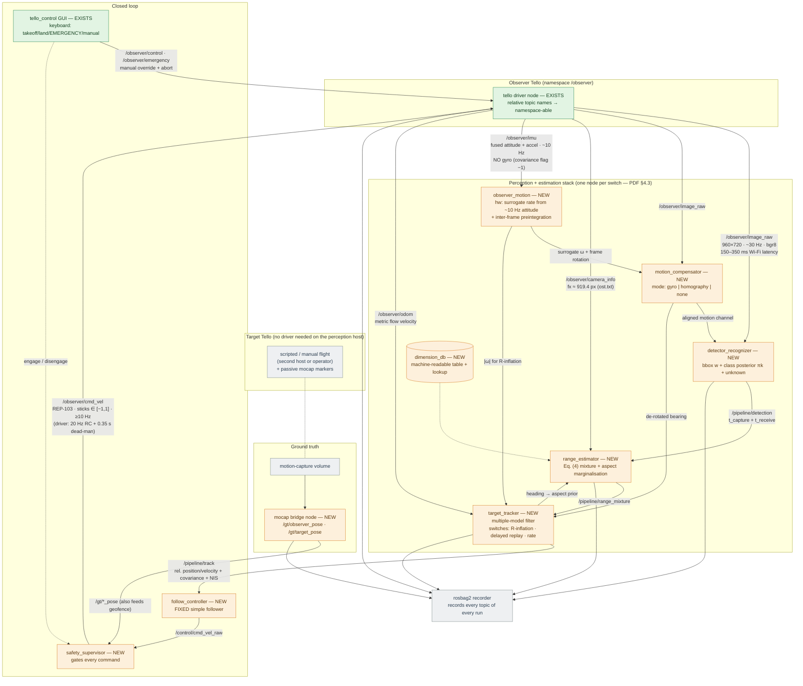
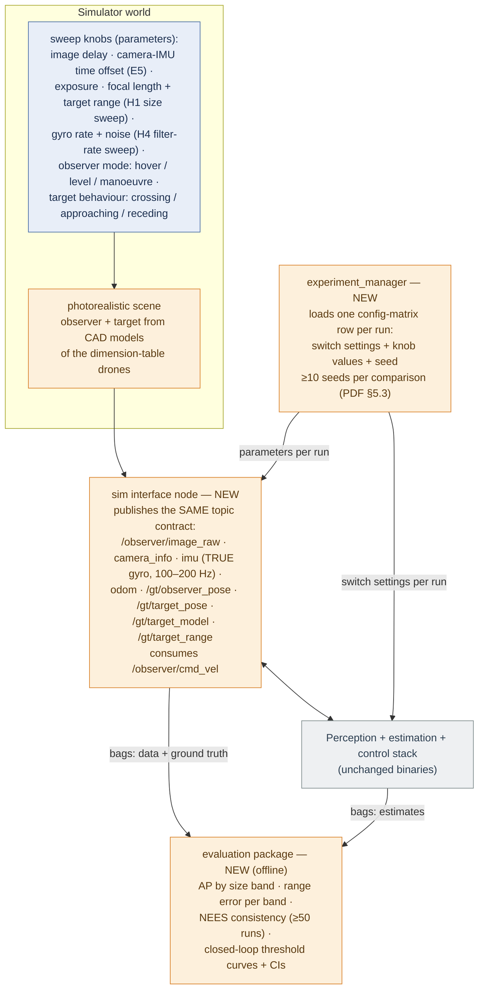
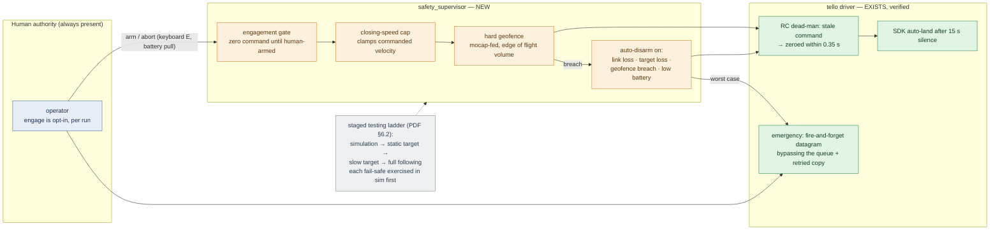

# Baseline Block Diagram — "Recognise, Then Range"

This document turns the proposal (PDF §1.2 Fig. 1 + §3 + §4) into an implementable ROS 2
architecture. Five views, from concept to wiring:

1. [The proposal pipeline](#1-the-proposal-pipeline-what-the-thesis-claims) — what the thesis claims, with the novelty colour code of the PDF's Fig. 1
2. [The one-contract principle](#2-the-one-contract-principle-simulation--hardware) — how simulation-first / hardware-second becomes a config change
3. [ROS 2 node graph, hardware phase](#3-ros-2-node-graph--hardware-phase-two-tellos-indoors)
4. [ROS 2 node graph, simulation phase](#4-ros-2-node-graph--simulation-phase)
5. [Safety chain](#5-safety-chain-ieee-7009-mechanisms-pdf-62) and the [ablation switchboard](#6-the-ablation-switchboard-pdf-43)

Colour code (identical to PDF Fig. 1): **red** = published, not claimed as new · **orange** =
exists, but in a different setting or without a fair comparison · **green** = no published
instance found (the thesis's novelty) · grey = standard machinery, not under test.

---

## 1. The proposal pipeline (what the thesis claims)

The pipeline has two halves (PDF §3): the **perception half** turns an image of a small drone
into a metric range *with honest uncertainty*, conditioned on the recognised model (C2); the
**estimation half** turns those measurements, taken from a moving observer, into a stable
track using the observer's gyroscope (C3). Every added part is a **switch** that can be turned
off so its contribution is measurable on its own (PDF §3, §4.3).

**How to read it.**
- The two feedback edges matter: the tracker's heading estimate sharpens the aspect-angle
  prior (PDF §3.3), and the closed loop moves the camera that feeds perception.
- The three orange switches are the entire C3 experiment: each has an image-only or naive
  counterpart, giving the single-switch ablation rows (PDF §3.5).
- Range error grows with the **square** of range (Eq. 2). Two design consequences propagate
  through everything downstream: errors are reported **per range band**, and the range
  uncertainty **must widen with distance** (PDF §3.1).
- The controller is grey on purpose: the proposal holds it fixed because it is not part of
  what is being tested (PDF §4.1). See [rl_analysis.md](rl_analysis.md) before changing that.

---

## 2. The one-contract principle (simulation ⇄ hardware)

PDF §4 mandates simulation-first, hardware-second, and §4.3 mandates that the ablation be a
**configuration matrix, not a code change**. The architectural consequence: the perception /
estimation / control stack must not know whether it is flying. Simulator and hardware drivers
publish the **same topic contract**; swapping phases is a launch-file substitution.

The dual timestamp (`t_capture` + `t_receive`) is a hard requirement of PDF §4.3 — "latency is
always a measured quantity". The existing driver already stamps on arrival with bounded error
(50 Hz change-detection polling, `node.py`), which is the hardware half of this promise.

---

## 3. ROS 2 node graph — hardware phase (two Tellos, indoors)

Green = exists on this repo's baseline (`workspace/src/`), verified. Orange = to be built.
The observer's driver topics are shown with their **measured** properties, not nominal ones.

**Verified hardware facts this wiring respects** (details + file references in
[implementation_plan.md](implementation_plan.md)):

- **There is no gyroscope on the Tello.** `/observer/imu` carries fused attitude (whole
  degrees, ~10 Hz, jittery) and accelerometer only; the driver marks angular velocity
  "not measured". The C3 "gyro" input on hardware is therefore a **surrogate rate**
  differentiated from attitude (~10 °/s quantisation noise) — exactly why PDF §4.2 promises
  the hardware inertial result only as a **lower bound**, with the full-rate result from
  simulation.
- **The target drone needs no driver on the perception host.** Its ground truth comes from
  mocap; it only has to fly patterns (crossing / approaching / receding — PDF §4.3). This
  sidesteps a real conflict: djitellopy binds UDP :8889 per process and both Tellos in AP
  mode share IP 192.168.10.1, so two drivers on one host do not coexist
  (options, if the target must be ROS-driven, in the plan).
- **The pixel-size regime works indoors.** With fx ≈ 919.4 px and the Tello's 98 mm body
  width: ~45 px at 2 m, ~30 px at 3 m, ~15 px at 6 m, ~10 px at 9 m — the tens-of-pixels
  regime of PDF §1.1 inside a mocap volume.

---

## 4. ROS 2 node graph — simulation phase

Identical stack; the two aircraft and the mocap system are replaced by the simulator, which
adds the sweep knobs the experiments need (PDF §4.1). Nothing downstream changes.

Two proposal-mandated details: the H1 size sweep is produced by **moving the target and
varying focal length, not by blurring the image** (PDF §4.1); and the three observer modes are
matched to Pliska et al. so the C3 numbers are directly comparable (PDF §4.1).

---

## 5. Safety chain (IEEE 7009 mechanisms, PDF §6.2)

Each fail-safe is a concrete mechanism with an owner. Several already exist in the verified
driver — they are the reason the closed loop can be attempted at all.

One honest gap to record: the proposal promises a "hardware kill-switch on both aircraft".
The Tello has no external kill line; the practical equivalents are the keyboard emergency
(motor cut via the driver's bypass path) and physically pulling the battery. This should be
stated in the thesis rather than papered over.

---

## 6. The ablation switchboard (PDF §4.3)

"The whole ablation is a configuration matrix rather than a code change." Every switch below
is a ROS 2 parameter of exactly one node; `experiment_manager` sweeps them.

| # | Switch | Options | Owner node | Swept by |
|---|--------|---------|-----------|----------|
| S1 | Size prior | fixed single width · recognised model width · recognised + aspect marginalisation | `range_estimator` | **E2** (H2) |
| S2 | Range baseline | depth foundation model, zero-shot (offline arm) | `evaluation` | **E2** (H2) |
| S3 | Range representation | mixture Eq. (4) · collapsed point estimate | `range_estimator` → `target_tracker` | **E3** (H3) |
| S4 | Motion compensation | gyro-aided · image-only homography · none | `motion_compensator` | **E4** (H4) |
| S5 | Measurement-noise inflation | scale R with observer rate · off | `target_tracker` | **E4** (H4) |
| S6 | Delay bridging | delayed filter at inertial rate · naive (filter at camera rate) | `target_tracker` | **E4** (H4) |
| S7 | Filter rate | swept, below → above camera rate | `target_tracker` | **E4** (H4) |
| S8 | Camera–IMU time offset | injected 0 → tens of ms | sim interface | **E5** (H4) |
| S9 | Target pixel size | range × focal length sweep | sim interface | **E1** (H1) |
| S10 | Recognition errors | forced misclassification injection | `experiment_manager` | **E3** (H3) |
| S11 | Observer mode | hover · level flight · manoeuvre | sim / flight plan | **E4, E6** |
| S12 | Capture threshold | family of thresholds (reported as curves, never one point) | `evaluation` | **E6** |

The controller has **no switch** — PDF §4.1 holds it fixed. If a learned (RL) controller is
ever added, it becomes a separate comparison arm of E6, not a row of this matrix
([rl_analysis.md](rl_analysis.md)).
