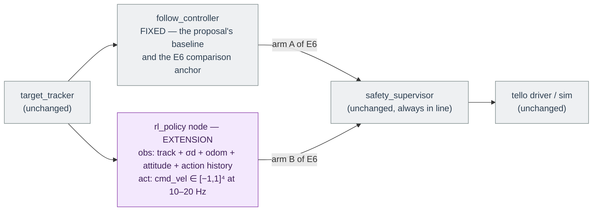

# Reinforcement Learning and This Proposal — Verified Finding + Extension Design

## 1. The verified finding: the proposal contains no reinforcement-learning method

This was checked, not assumed. The full 16-page text of `preview_content-only.pdf` was
extracted and swept for every RL-related term (`reinforcement`, `reward`, `policy`, `MDP`,
`Markov`, `Q-learning`, `PPO`, `SAC`, `DQN`, `actor`, `critic`, `agent`, `gym`).

**The single genuine occurrence** is in §5.3 (*Expected Effect Sizes and Statistics*):

> "Every comparison is reported with confidence intervals over at least ten random seeds,
> because seed variation alone can otherwise produce apparently significant differences, as
> Henderson et al. showed for reinforcement-learning results [27]."

That is a citation about **statistical reporting discipline** (Henderson et al., *Deep
Reinforcement Learning that Matters*, AAAI 2018), imported as a methodology standard. It does
not introduce an RL method, and nothing else in the document does: no states, no actions, no
reward, no learning algorithm. (Every other keyword hit is the substring "actor" inside
"f**actor**".)

## 2. What the proposal actually specifies for closed-loop control

- §4.1: *"A simple following controller closes the loop; **the controller is held fixed across
  all perception and estimation variants, because it is not part of what is being tested**."*
- Table 1, E6: closed-loop following scored by success rate, time-to-close, and closest
  approach — with success reported **as a curve over the capture threshold**, never at one
  point (§5.1).
- §7 / Table 3, Q7: an explicit slot for *"optional, evidence-gated extensions"*.

So in the document as written, the closed loop exists to prove that perception/estimation
gains reach a closed-loop number (E6) — the controller is deliberately boring.

## 3. What follows from this

Two readings are possible, and the choice belongs to the thesis owner (worth confirming with
the advisors before any RL work is scheduled):

1. **The proposal is as intended** → no RL is implemented. The follower is a fixed, simple
   controller (e.g. proportional bearing-centring + range closure with a speed cap), and
   everything in §4 below is out of scope.
2. **A learned controller is intended** (e.g. a newer draft, or an agreed direction not yet in
   this PDF) → it must enter as an **extension** — the Q7 slot — and as a **separate
   comparison arm of E6**, never as a row of the C2/C3 ablation matrix. Reason: the proposal's
   scientific design *depends* on the controller being fixed while perception/estimation
   switches flip; letting the controller adapt would confound every C2/C3 measurement.

The clean protocol if RL is adopted:
**(a)** run the entire C2/C3 programme with the fixed controller, exactly as proposed;
**(b)** freeze the best perception/estimation configuration;
**(c)** compare *fixed controller vs learned policy* on E6's three metrics, same stack, same
scenarios, ≥10 seeds with confidence intervals — which is precisely the Henderson [27]
protocol the proposal already commits to.

---

## 4. RL extension design (⚠ not from the PDF — a proposal-compatible design, to adopt or reject)

Everything below is grounded in the verified platform and the proposal's constraints, but it
is **my design for the extension**, not something the document specifies.

### 4.1 Task framing

Learn a **following/interception policy** for the observer: close to (or hold station on) the
tracked target. This is a **POMDP**, not a clean MDP, for reasons measured on this repo:
150–350 ms video latency, ~10 Hz jittery telemetry, range noise growing as d² (Eq. 2), and a
target that can leave the field of view. The policy therefore needs history (action stack or
recurrence) — a memoryless policy fed instantaneous state will fight the latency and lose.

A deliberate scope decision: the policy consumes the **tracker output, not pixels**.
End-to-end pixels-to-action RL would bypass the thesis's actual contributions (C1–C3), need
orders of magnitude more data, and make E6 unattributable. The perception/estimation stack
stays exactly as in [block_diagram.md](block_diagram.md); RL swaps one grey box.

### 4.2 Observation (policy input) — every entry available on both sim and hardware

At policy rate (10–20 Hz), all in the observer **body frame** (never absolute yaw — it
free-runs on this platform):

| # | Entry | Dim | Source |
|---|---|---|---|
| 1 | relative target position (from range + de-rotated bearing) | 3 | `/pipeline/track` |
| 2 | relative target velocity | 3 | `/pipeline/track` |
| 3 | range uncertainty σd (from the mixture) — the policy should behave differently when the range is honest-but-wide | 1 | `/pipeline/range_mixture` |
| 4 | target-visibility flag + time since last confirmed detection | 2 | `/pipeline/track` |
| 5 | observer velocity (metric, from the flow estimator) | 3 | `/observer/odom` |
| 6 | observer roll, pitch (gravity-referenced; yaw excluded) | 2 | `/observer/imu` |
| 7 | last k actions (k ≈ 4 covers 350 ms at 10 Hz) — the latency-compensation memory | 4k | internal |

≈ 30 inputs with k = 4. Optionally replace the action stack with a small GRU/LSTM policy;
start with the stack (simpler, easier to reproduce seed-to-seed), fall back to recurrence if
E6 curves show latency-induced overshoot.

### 4.3 Action (policy output) — the verified command interface

`a = (vx, vy, vz, ωyaw) ∈ [−1, 1]⁴` — exactly the driver's `/cmd_vel` contract (REP-103,
normalised sticks, scaled to SDK ±100 internally). Continuous. Published at the policy rate
(≥10 Hz — the driver's 0.35 s dead-man zeroes anything slower, which is a *feature*: a hung
policy stops the aircraft). Actions pass through `rtr_safety` **always** — see 4.6.

### 4.4 Reward — derived from E6's own metrics, nothing invented

Per step (Δt = policy period), with dt the estimated range and e_b the bearing error:

```
r_t =  w1 · (d_{t-1} − d_t)          # progress: closing the gap (potential-based)
     − w2 · |e_b|                    # keep the target centred → keeps it in FOV
     − w3 · ‖a_t‖²                   # actuation cost
     − w4 · ‖a_t − a_{t-1}‖²         # smoothness (Tello sticks saturate fast)
     − w5 · 1[target lost this step] # losing the track is the dominant failure
```

Terminal events:
- **success**: d < capture threshold **while closing speed ≤ the safety cap** → bonus.
  Train at one threshold; evaluate as the threshold *curve* (§5.1 requires curves, and a
  policy trained at 1 m can still be scored at 0.5/1/2 m).
- **failure**: geofence contact, target lost longer than a timeout, or episode timeout →
  penalty and termination. (Geofence contact terminates in training; in flight the supervisor
  prevents it ever occurring.)

For a *standoff-following* variant (hold distance d\*), replace the progress term with
−w1·|dt − d\*|. E6's wording ("did it close the gap, how fast, how close") is the
gap-closing task; implement that first.

### 4.5 Algorithm and training protocol

- **PPO (clipped)** as the primary algorithm: continuous actions, robust to the noisy,
  delay-dominated dynamics, trivially parallelised over vectorised simulator instances, and
  the easiest to make reproducible across seeds. **SAC** as the documented alternative if
  sample budget becomes the constraint. Standard machinery: γ ≈ 0.99, GAE(λ ≈ 0.95),
  observation normalisation, entropy regularisation.
- **Where it trains**: the timing-faithful simulator arm (implementation plan §5.1) — the
  E3/E4/E5 sensor-timing sim *is* the RL gym; photorealism is irrelevant because the policy
  never sees pixels. Same topic contract, so the trained policy node drops into the full
  stack unchanged.
- **Domain randomisation** (each item is a measured platform property, not a guess): video
  latency 150–350 ms + jitter; telemetry rate/jitter around 10 Hz; range noise σd ∝ d²;
  occasional misclassification events (posterior swapped → range bias/widening, tying into
  E3); target behaviour and speed (crossing / approaching / receding); observer dynamics
  perturbations; detection dropouts.
- **Curriculum mirroring the safety ladder (§6.2)**: static target → slow target → full
  behaviours. The same ladder then gates hardware exposure, so training stages and flight
  clearance stages are one story.
- **Statistics**: ≥10 seeds, confidence intervals, identical evaluation scenarios for policy
  and fixed controller — the Henderson [27] discipline the proposal already mandates, which
  exists *because of* RL's seed sensitivity.

### 4.6 Safety: the policy is never trusted

`rtr_safety` sits between **any** controller and the driver and does not know or care that the
command came from a network: engagement gate, geofence, closing-speed cap, auto-disarm,
emergency path. Train **with the clamps active** (shielded training) so there is no
train/deploy mismatch, and keep the human abort exactly as in the fixed-controller case.
This preserves the proposal's IEEE 7009 framing and its meaningful-human-control position
(§6) without modification — the learned policy changes nothing in section 6 of the thesis.

### 4.7 Where it plugs in



One node swapped, one launch argument (`controller:=fixed|rl_policy`), everything else —
perception, estimation, safety, scoring — byte-identical between the two E6 arms.

### 4.8 Summary: in the PDF vs. added by this extension

| | In the proposal (verified) | RL extension (this document, §4) |
|---|---|---|
| Closed-loop controller | simple follower, held fixed | learned policy as a *second arm* of E6 |
| States / actions | none defined | §4.2 / §4.3 above |
| Reward | none defined | §4.4, derived from E6's metrics |
| Algorithm | none | PPO (SAC alternative) |
| Training data | n/a | timing-faithful simulator + domain randomisation |
| Safety | IEEE 7009 mechanisms | identical — supervisor shields the policy |
| Statistics | ≥10 seeds + CIs (Henderson [27]) | same protocol, doubly necessary |
| Where in the plan | — | Q7 "optional, evidence-gated extensions" |
